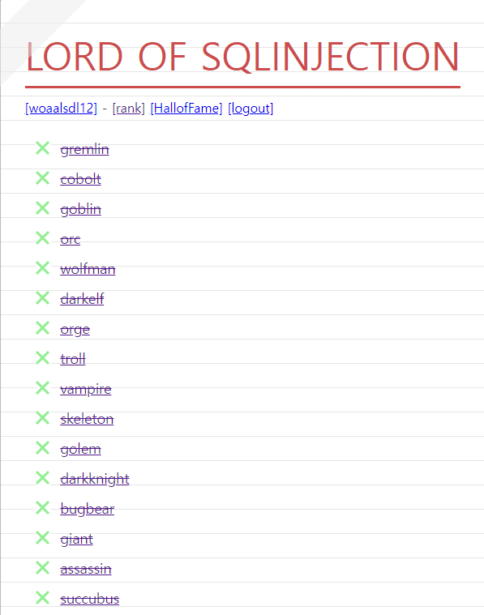

##### 해당 게시글은 빡공팟 4기(with TeamH4C)와 관련되어 있습니다
-----

# W8:  LOS 서큐버스 까지 클리어 후 write-up

 

- [https://los.rubiya.kr/](https://los.rubiya.kr/)

 
 
 

-----

# 정리글

## > 문제별 라업

1. [gremlin](https://jminis.github.io/docs/P4C/Day51/#-lord-of-sql-injection-gremlin)
2. [cobolt](https://jminis.github.io/docs/P4C/Day51/#-los-cobolt)
3. [goblin](https://jminis.github.io/docs/P4C/Day51/#los-goblin)
4. [orc](https://jminis.github.io/docs/P4C/Day52/#-lord-of-sql-injection-orc)
5. [wolfman](https://jminis.github.io/docs/P4C/Day52/#los-wolfman)
6. [darkelf](https://jminis.github.io/docs/P4C/Day52/#los-darkelf)
7. [orge](https://jminis.github.io/docs/P4C/Day52/#los-orge)
8. [troll](https://jminis.github.io/docs/P4C/Day52/#los-troll)
9. [vampire](https://jminis.github.io/docs/P4C/Day52/#los-vampire)
10. [skeleton](https://jminis.github.io/docs/P4C/Day52/#los-skeleton)
11. [golem](https://jminis.github.io/docs/P4C/Day52/#los-golem)
12. [darkknight](https://jminis.github.io/docs/P4C/Day53/#-lord-of-sql-injection-darkknight)
13. [bugbear](https://jminis.github.io/docs/P4C/Day53/#-lord-of-sql-injection-bugbear)
14. [giant](https://jminis.github.io/docs/P4C/Day53/#-lord-of-sql-injection-giant)
15. [assassin](https://jminis.github.io/docs/P4C/Day53/#-lord-of-sql-injection-assassin)
16. [succubus](https://jminis.github.io/docs/P4C/Day53/#-lord-of-sql-injection-succubus)

  

## > 그 이후

이번 주에 bob 서류 합격과 인적성 시험, 필기 시험을 보면서 한창 더 해야겠다는 생각이 들었습니다. 군 전역 이후 bob 지원만 바라보고 달려왔던터라 지원 이후에 약간의 번아웃이 왔었는데 P4C 과제 덕분에라도 찔끔찔끔 공부를 하게 되었습니다. 다음 주 면접 준비를 하면서도 과제 잊지 않고 진행하며, 스스로 더 해나가도록 하겠습니다.

16번까지인게 아쉬워서 20번까지 !!

17.[zombie_assassin](https://jminis.github.io/docs/P4C/Day56/#-lord-of-sql-injection-zombie_assassin)  
18.[nightmare](https://jminis.github.io/docs/P4C/Day56/#-lord-of-sql-injection-nightmare)  
19.[xavis](https://jminis.github.io/docs/P4C/Day56/#-lord-of-sql-injection-xavis)  
20.[dragon](https://jminis.github.io/docs/P4C/Day56/#-lord-of-sql-injection-dragon)  