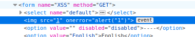

##### 해당 게시글은 빡공팟 4기(with TeamH4C)와 관련되어 있습니다
-----
중간 난이도로 설정한 뒤 시작!

# > DVWA: SQL injection


low와는 다른 UI인 모습이다.


## 삽질

low 레벨에서 인자는 GET 방식이였으나

```php
...
if( isset( $_REQUEST[ 'Submit' ] ) ) {
    // Get input
    $id = $_REQUEST[ 'id' ]; 
...
```
medium 레벨은 POST 방식이다

```php
...
if( isset( $_POST[ 'Submit' ] ) ) {
    // Get input
    $id = $_POST[ 'id' ]; 
...
```

쿼리를 직접 입력하던 때와 달리 숫자만 전달할 수 있는 것으로 보이지만 결국에는 POST 전달 방식이기 때문에 패킷을 가로챈 뒤 수정해서 전달하면 충분히 공격 가능할 것이다.

<br>

## Write up

날라가는 패킷의 정보를 보면 다음과 같다


해당 부분의 id를 수정하여 전달해보면


공격이 가능한 것을 확인할 수 있다. 이전 low 레벨과 똑같은 쿼리문들을 날리면 되지만 전송하는 방식만 POST 방식으로 수정하여 전달하면 되겠다.


<br><br><br>

-----

# > DVWA: SQL injection blind


## 삽질

SQL injection 문제처럼 전달 방식만 달라졌으므로 sqlmap을 이용해 공격을 시도해보아도 괜찮겠다

<br>

## Write up

sqlmap에서 post 방식으로 값을 전달할 경우에 `--data` 속성을 이용하여 전달하면 된다. `-p`는 전달하려는 파라미터 값을 의미하므로 사용자의 입력이 전달되는 파라미터인 'id'를 작성하면 되겠다.

```bash
sqlmap -u "http://localhost/DVWA/vulnerabilities/sqli_blind/" --cookie="PHPSESSID=sjqrpvkblh60tgoojvko5biuo5; security=medium" --data "id=5&Submit=Submit" -p id
```

지난 번과 마찬가지로 똑같이 취약한 공격을 찾아주었고 이전처럼 하나하나 찾아가며 공격하면 될 듯하다.


다만 너무 툴에 의존하는 듯한 느낌이 들어서 bob 지원이 끝나면 직접 블라인드 인젝션을 수행하기 위한 파이썬 코드를 한 번 작성해보아야 겠다. brute force처럼 참과 거짓을 반환하는 결과물을 바탕으로 반복하는 원리로 짜면 될 듯하다.

<br><br><br>

-----

# > DVWA: Weak session IDs


## 삽질

```php
if ($_SERVER['REQUEST_METHOD'] == "POST") {
    $cookie_value = time();
    setcookie("dvwaSession", $cookie_value);
} 
```

1씩 증가하여 너무 쉽게 예측가능했던 low 단계에서 `time()`을 이용하여 서버 시간으로 세션 값을 받는다. 

<br>

## Write up

결국 서버의 시간과 동일한 환경을 만든 뒤 time() 함수를 이용한다면 세션 값을 예측할 수 있겠다.

<br><br><br>

-----

# > DVWA: DOM based XSS

## 삽질

```php
    # Do not allow script tags
    if (stripos ($default, "<script") !== false) {
        header ("location: ?default=English");
        exit;
    } 
```

이번 문제에서 `<script` 문장이 포함될 경우에 강제로 English가 선택되도록 코드가 작성 되어 있다.

`script` 태그로는 할 수 없으니 이전에 `img` 태그를 이용하여 스크립트를 실행시키던 방법을 사용해야 겠다.

<br>

## Write up

소스코드를 유심히 살펴보면 전달한 default 값이 페이지 소스에 영향을 준다는 것을 알 수 있다. 그렇기 때문에 img 태그와 `onerror` 이벤트를 결합하여 올바르지 않은 이미지를 업로드 시키면서 스크립트 문을 실행시키면 되겠다. 이벤트는 기본적으로 자바스크립트를 작성하는 것이 default이기 때문에 `<script>` 를 작성하지 않아도 된다.

`</select>`를 전달한 모습


이후 확인한 소스코드



이렇게 자바스크립트를 실행하는데 성공했다

<br><br><br>

-----

# > DVWA: Reflected XSS

## 삽질

```php
if( array_key_exists( "name", $_GET ) && $_GET[ 'name' ] != NULL ) {
    // Get input
    $name = str_replace( '<script>', '', $_GET[ 'name' ] );
```

`<script>` 를 입력받으면 공백으로 치환하는 코드가 생겼다. 겹쳐서 쓰면 못막쥬?!

<br>

## Write up

`<sc<script>ript>alert("1")</script>` 이렇게 작성하면 `<script>` 부분이 공백으로 치환되면서 `<script>alert("1")</script>` 이 완성!


<br><br><br>

-----

# > DVWA: Stored XSS

## 삽질

```php
 // Sanitize name input
    $name = str_replace( '<script>', '', $name );
    $name = ((isset($GLOBALS["___mysqli_ston"]) && is_object($GLOBALS["___mysqli_ston"])) ? mysqli_real_escape_string($GLOBALS["___mysqli_ston"],  $name ) : ((trigger_error("[MySQLConverterToo] Fix the mysql_escape_string() call! This code does not work.", E_USER_ERROR)) ? "" : ""));
```

~~작성한 글의 제목 부분에 `<script>` 가 치환되도록 되어있다. 우회하는 방법도 알고 있지만 내용 부분에는 따로 검사 조건이 없기 때문에 그냥 내용 부분에 스크립트를 넣으면 실행될 것이다.~~

<br>

라고 생각하여 시도하다보니 놓친 코드가 있었다

```php
// Sanitize message input
$message = strip_tags( addslashes( $message ) );
$message = ((isset($GLOBALS["___mysqli_ston"]) && is_object($GLOBALS["___mysqli_ston"])) ? mysqli_real_escape_string($GLOBALS["___mysqli_ston"],  $message ) : ((trigger_error("[MySQLConverterToo] Fix the mysql_escape_string() call! This code does not work.", E_USER_ERROR)) ? "" : ""));
$message = htmlspecialchars( $message ); 
```

처음보는 함수가 껴져 있었지만 내용 부분에 태그 사용을 막은 듯한 코드가 들어있다. 글의 제목 부분의 script 치환을 우회하여 공격해야겠다.

<br>

## Write up

php의 `strip_tags` 함수는 태그를 제거하는 함수로 인자로 전달된 문자열의 태그를 떼버린다. 그리고 php의 `addshlashes` 함수는 이스케이프 문자를 자동으로 추가해줌으로써 특수 기호를 사용하였을 때 문법에 오류가 나는 상황을 방지해준다. 결국 message 박스에 전달하는 스크립트는 실행 불가능함을 알 수 있다.

그리하여 `script` 태그를 str_replace로 치환하는 name 박스에 스크립트 문을 넣어 실행해야 한다.


이렇게 전달하면서 스크립트 로드에 성공했다


추가적으로 name 부분의 입력 제한이 걸려있는 듯하지만


이 부분을 수정하면서 해결했다.

<br><br><br>

-----

# > DVWA: CSP bypass

## 삽질

```php

$headerCSP = "Content-Security-Policy: script-src 'self' 'unsafe-inline' 'nonce-TmV2ZXIgZ29pbmcgdG8gZ2l2ZSB5b3UgdXA=';";

header($headerCSP);

// Disable XSS protections so that inline alert boxes will work
header ("X-XSS-Protection: 0");

# <script nonce="TmV2ZXIgZ29pbmcgdG8gZ2l2ZSB5b3UgdXA=">alert(1)</script>
```

처음보는 문법들이 생겼다. HTTP의 "X-XSS-Protection"헤더는 XSS 공격을 감지할 경우에 페이로드 전송을 중지시키는 기능을 한다고 한다.

<div clss="code-example">
X-XSS-Protection: 0;<br>
X-XSS-Protection: 1;<br>
X-XSS-Protection: 1; mode=block<br>
X-XSS-Protection: 1; report=&lt;reporting-uri&gt;<br>
</div>
위 문제에서 사용된 기법은 비활성화이기에 따로 스크립트를 막지는 않는다. 

그러나 CSP 정책은 걸려있기에 일반적인 스크립트문 삽입은 불가능한 것으로 보인다. 이 중에서 잘 살펴보면 `unsafe-inline`과 `noce-...`가 삽입되어 있는데 이 둘은 각각 다음을 의미한다.

`unsafe-inline`: 소스코드 내 자바스크립트와 CSS를 허용
'nonce-암호화된문자': nonce 옵션값이 일치할 경우 인라인 자바스크립트 및 CSS를 허용

nonce 옵션은 `<script nonce="1234..."></script>` 와 같이 작성하여 값을 부여한다. 일반적으로 유추할 수 없는 수를 사용하며 sha256과 같은 해시함수를 이용해 암호화한다. 이번 문제에서는 nonce값이 확인 가능하기에 스크립트 문을 마음대로 삽입할 수 있겠다.

<br>

## Write up

문제의 주어진 CSP 정보를 바탕으로 XSS 필터링이 없으며, nonce 옵션으로 스크립트 삽입이 가능한 것을 알 수 있다.


이렇게 nonce 옵션값을 이용하여 스크립트 문을 삽입할 수 있다.


<br><br><br>

-----

# DVWA: javascript

## 삽질

```js
function do_something(e){
	for(var t="",n=e.length-1;n>=0;n--)
		t+=e[n];
	return t
}
setTimeout(function(){do_elsesomething("XX")},300);
function do_elsesomething(e){
	document.getElementById("token").value=do_something(e+document.getElementById("phrase").value+"XX")
}
```

`.js ` 확장자의 파일이 추가적으로 제공되었는데 아마도 해당 연산을 진행하여 token 인증을 하는 것 같다. 이전 문제처럼 역연산을 이용하여 success 문자와 함께 토큰 값을 전달해주면 될 듯하다.


이 토큰이 만들어지는 방법을 역추적해보자.

<br>

## Write up

`do_something` 함수부터 분석을 해보면 전달받은 인자의 인덱스를 내림차순으로 하나씩 t 변수에 저장한다.  
문자열을 거꾸로 만들기 위한 작업인 듯하다.

`do_elsesomething` 함수에서는 "XX"+입력받은값+"XX"을 do_something에 전달한다.  
아마 이 부분을 통해 "XX"가 붙혀서 나오고 문자열이 거꾸로 되는 듯하다.

결국 "success" 문자열 앞 뒤에 "XX" 붙히고 해당 문자열을 거꾸로만 만들어서 "token"으로 전달하면 풀리겠다.


gg

low 단계 덕분에 개념이 박힌 상태에서 문제를 접하니 우회 방식만 생각해내면 다 풀리는 느낌이였다. 딱 low를 지나 high를 가기 전에 쉬어가기 좋은 단계라고 생각한다. 집중할 수 있는 환경이 갖추어져서 빠르게 할 수 있었던 것 같다. 조금 다듬는 작업을 끝내고 모레에 있을 sqld 공부에 집중해야 겠다. 