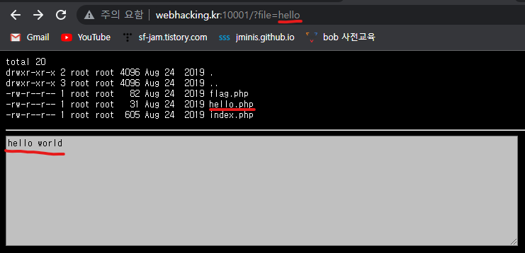

##### 해당 게시글은 빡공팟 4기(with TeamH4C)와 관련되어 있습니다

-----

# > Webhacking.kr:old-01(php)


## writeup

```php
<?php
  include "../../config.php";
  if($_GET['view-source'] == 1){ view_source(); }
  if(!$_COOKIE['user_lv']){
    SetCookie("user_lv","1",time()+86400*30,"/challenge/web-01/");
    echo("<meta http-equiv=refresh content=0>");
  }
?>
<html>
<head>
<title>Challenge 1</title>
</head>
<body bgcolor=black>
<center>
<br><br><br><br><br>
<font color=white>
---------------------<br>
<?php
  if(!is_numeric($_COOKIE['user_lv'])) $_COOKIE['user_lv']=1;
  if($_COOKIE['user_lv']>=4) $_COOKIE['user_lv']=1;
  if($_COOKIE['user_lv']>3) solve(1);
  echo "<br>level : {$_COOKIE['user_lv']}";
?>
<br>
<a href=./?view-source=1>view-source</a>
</body>
</html>
```

문제에서 주어지는 소스코드이고 Cookie 값의 변조를 유도하고 있다. 페이지에 처음 접속했을 때 `user_lv`라는 쿠키값이 생성된다. 이후 해당 쿠키의 값이 숫자가 아닐 경우, 4보다 크거나 같을 경우 1로 설정한다. 그리고 쿠키의 값이 3보다 클 경우에 문제를 푸는 듯한 `solve` 함수가 호출된다.

3보다 크지만 4보다 작아야하는 숫자를 넣어야하는데 소수점이 포함되어도 숫자이기에 3.5를 대입했다. 당연히 개발자 도구를 이용해서 COOKIE값을 넣어주었다.


이렇게 문제를 풀 수 있었다.


<br><br><br>

-----


# > Webhacking.kr:old-023(php)

## 삽질


`alert` 함수를 실행시키라고 되어있지만 정작 넣으면 "no hack" 이라는 문구가 뜬다. 하지만 소스 코드가 주어져 있기에 어떠한 방식으로 필터링이 되어 있는지 알 수가 없다.

그러나 문장을 넣다 보면 특정 문자들에만 "no hack"이라는 문구가 뜨는 것을 확인할 수 있었고, 입력한 문자들이 html에 반영된다는 php 코드임을 확인할 수 있었다.


특정 문자를 넣었을 때 아래와 같이 나와야 하지만 `<`와 `>` 기호는 태그를 의미하기 때문에 삽입이 되는 듯하다.


그리하여 태그를 활용한 스크립트문을 실행하는 방법을 모색하였다.  
-> 도중에 문자가 2개 이상 입력이 불가능하다는 점을 깨달았다. 풀이의 방향을 알 수 없는 필터링 함수의 우회로 잡아야할 듯하다. 여태 만났던 필터링 함수를 생각해보면 `preg_match`, `ereg_replace`, `str_replace`, 등이 있었던 것 같다. 일단 시도해보자.

이제야 이 정보를 제대로 알아봤다는게 생각보다 공부를 대충하고 있었던 건 아닐까 뜨끔했다. 꽤 많이 만나서 친해졌음에도 아직 함수와 통성명조차 하지 않았었던 것이다. 

`ereg` 함수는 문자열에서 대,소문자 구별을 하여 특정 문자를 찾는 함수이다.  
`eregi` 함수는 문자열에서 대소문자 구별없이 특정 문자를 찾는 함수이다.  
이 두 함수는 취약하여 PHP 5.3 버전 이후로는 사라졌으며 다음 함수로 대체되었다.

`preg_match` 함수는 인자에 `/i`를 넣으면 대소문자 구별없이 문자를 찾고,  
넣지 않으면 대소문자 구별을 하여 문자를 찾아내는 함수로 아직까지 취약점이 없다고 한다.

`ereg` 함수에서는 대상 문자열에 널바이트가 존재할 경우 제대로 찾지 못한다고 한다. 제발 이 php에서는 이 함수를 썼길 바라며 도전...\~\~

<br>

## writeup

여러 문자와 특수기호를 대입해보는 삽질을 통해서 문자 2개가 연속으로 입력될 경우에 "no hack"을 출력시킨다. 하지만 만약 `ereg` 함수를 이용해 필터링을 했다면 `ereg` 함수에서는 문자열에 널바이트가 존재할 경우에 조건에 맞는 탐지가 이루어지지 않는 취약점이 있다.


따라서 위와 같이 문자 사이에 NULL을 의미하는 `%00` 인코딩 문자를 삽입함으로써 우회할 수 있다.

```
<s%00c%00r%00i%00p%00t>a%00l%00e%00r%00t(1);</s%00c%00r%00i%00p%00t>
```

위와 같이 URL로 전송을 하였고 


alert가 발생되면서 풀었다.


<br><br><br>

-----


# > Webhacking.kr:old-024(php)

## 삽질

```php
<?php
  include "../../config.php";
  if($_GET['view_source']) view_source();
?><html>
<head>
<title>Challenge 24</title>
</head>
<body>
<p>
<?php
  extract($_SERVER);
  extract($_COOKIE);
  $ip = $REMOTE_ADDR;
  $agent = $HTTP_USER_AGENT;
  if($REMOTE_ADDR){
    $ip = htmlspecialchars($REMOTE_ADDR);
    $ip = str_replace("..",".",$ip);
    $ip = str_replace("12","",$ip);
    $ip = str_replace("7.","",$ip);
    $ip = str_replace("0.","",$ip);
  }
  if($HTTP_USER_AGENT){
    $agent=htmlspecialchars($HTTP_USER_AGENT);
  }
  echo "<table border=1><tr><td>client ip</td><td>{$ip}</td></tr><tr><td>agent</td><td>{$agent}</td></tr></table>";
  if($ip=="127.0.0.1"){
    solve(24);
    exit();
  }
  else{
    echo "<hr><center>Wrong IP!</center>";
  }
?><hr>
<a href=?view_source=1>view-source</a>
</body>
</html>
```

아예 처음 보는 유형이라 어떻게 접근해야할지 뇌가 멈췄다. 

`$REMOTE_ADDR`: 웹서버에 접속한 접속자의 IP정보를 갖고 있습니다.

이 정보가 루프백 주소인 127.0.0.1 여야 한다. burp suite에 그런 기능이 있나..? 날라가는 패킷을 붙잡고 살펴보니 딱히 사용자의 접속 IP 정보를 수정할만한게 없었다.

`extract`: 배열 속의 키값을 변수화 시켜주는 함수이다.

위 코드에서 `extract($COOKIE);`를 진행하면 쿠키값인 `PHPSESSID:???` 가 `$PHPSESSID=???`로 되는 셈이다. 근데 이러면 문제 풀었지 않나..??

<br>

## writeup

이 문제에서는 `$REMOTE_ADDR`에 127.0.0.1을 담아야하고, 이를 방해하기 위해 존재하는 `str_replace()`를 우회해야 한다. 하지만 해당 함수는 공백으로 치환하는 특성때문에 우회하기 쉽겠다.

`extract($COOKIE);` 코드 라인이 존재하기 때문에 쿠키 값으로 `$REMOTE_ADDR` 키와 루프백이 완성될 수 있는 키값을 넣어주면 되겠다.


```
12277...00...00...1
```


오 문제가 신박했다.

<br><br><br>

-----

# > Webhacking.kr:old-025(php)

## 삽질



왠지 `cat $\_GET[$file].php` 이런 식였으면 좋겠다. 다만 index나 flag가 바로 읽어지지 않는 것을 보니 다른 것들이 있나보다.

file의 파라미터값을 `./index`와 `index`로 넘겼을 때 결과가 다르다. 전자는 현재 페이지의 html이라도 출력이 되는데 그냥 index로 보내면 아무것도 출력이 안된다.

<br>

전혀 모르겠다.

<br>

오케이 면접준비

<br><br>

## writeup

**'22.06.20**
{: .text-red-000}

샤워하면서도 생각을 해봤는데 도저히 우회할 방법이 생각나지 않았다. 그래서 문제를 풀기 위한 키워드를 찾아보았는데 대충 "LIF" 취약점이라는 문구가 보였다. 그래서 찾아보았다.

LIF는 Local File Inclusion의 약자로 웹사이트에서 include, require, require_once, file_get_contents, fopen 등의 함수를 사용할 때 발생한다. 단, 파일 참조 시에 접근하는 디렉토리 정보를 사용자로부터 입력받을 경우에 발생된다. 그리고 `php wrapper`와 결합하여 서버에 존재하는 파일들을 읽어올 수 있다.

PHP wrapper에서 wrapper는 코드나 데이터를 감싸는 의미로 php의 wrapper는 `php://`와 같이 사용한다.  

1. expect://\<system command\>  
   system command를 실행한다.
2. php://filter/  
   다양한 In/Out stream을 다룬다. convert.base64-encode와 resource랑 결합
3. zip://  
   파일의 압축을 풀고 `#<파일명>`을 뒤에 붙혀 파일 안의 특정 파일을 실행할 수 있다.
4. php://stdin  
   stdin,stdout,stderr로 연결한다.
5. php://fd/\<fd number\>  
   파일 디스크립터에 연결한다.
6. php://input  
   post 데이터를 입력받는다. 

이 중에서 `php://filter`의 사용법을 알아보면.

```php
php://filter/convert.base64-encode/resource=/flag
```

flag라는 파일의 정보를 base64로 인코딩된 정보로 받아볼 수 있다.


flag의 내용이 정말로 인코딩 된 값으로 나오고 이것을 복호화하면

```php
<?php
  echo "FLAG is in the code";
  $flag = "FLAG{this_is_your_first_flag}";
?>
```

이렇게 플래그를 획득할 수 있다.

아니 '22.06.20 20:48분 웹해킹.kr 서버가 터졌다;;;


얼른 flag인증하고 밀렸던 과제들 해야하는데 ㅠㅠㅠㅠㅠ