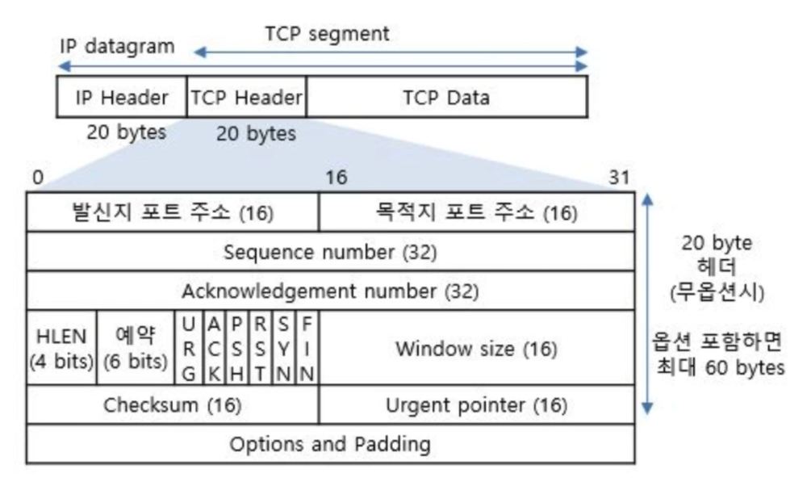
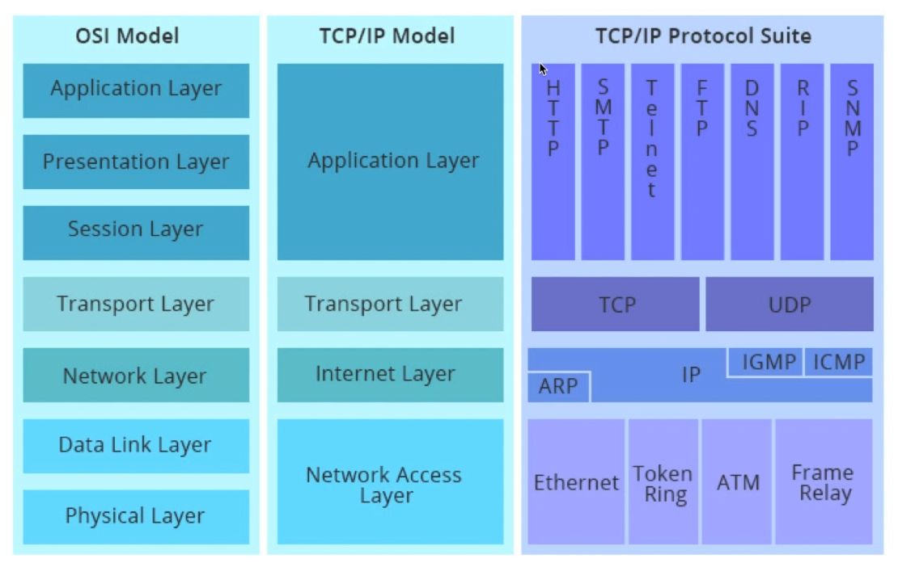

##### bob 11th 지원대상자가 이수해야 할 사전 교육에 대한 학습 일지입니다.

-----

# 지난 강의 Review
## 1. 인터넷 VS 컴퓨터 네트워크
- 컴퓨터 네트워크
  - 분산되어 있는 컴퓨터들이 통신망으로 이어져 있는 망의 형태

- 인터넷
  - TCP/IP를 사용하는 전세계를 잇는 컴퓨터 네트워크

## 네트워크 보안 요소 5가지
- 기밀성(Credentiality)
  - 데이터 기밀성은 의도되지 않거나 적법하지 않은 접근이나 유출 또는 탈취로부터 데이터를 보호하는 것입니다. 예를 들어, 패킷 스니핑은 대표적으로 데이터 기밀성을 해치는 공격 기법입니다. 패킷 스니핑과 같은 기밀성을 해치는 공격에 대해서 패킷 암호화를 대책으로 세울 수 있습니다.

- 무결성(Integrity)
  - 데이터 무결성은 부적절한 유지 관리, 수정 또는 변경으로부터 데이터를 보호하는 것입니다.  MITM attack처럼 중간에서 데이터를 가로채 위조나 변조를 할 수 있습니다. 이러한 공격을 막는 데에도, 데이터 암호화가 가장 기본적이고 최선의 방법입니다.

- 가용성(Availability)
  - 데이터 가용성은 데이터의 접근과 사용에 있어서 적시성과 신뢰성을 보장하는 것입니다 DDos가 대표적으로 데이터 가용성을 해치는 공격인데, 데이터 가용성은 단일 대책으로는 보장하기 어려운 범위입니다. 항상 모니터링도 해줘야 하고, 탐지가 되면 공격 기법에 따른 대책을 빨리 세워서 대응을 하는 등 일련의 과정을 거쳐야만 가용성을 보장할 수 있을 것입니다.

- 서버 인증(Server Authentication)
  - 적법한 서버와 통신하는 것을 보장하는 인증이다.

- 클라이언트 인증(Client Authentication)
  - 서버가 클라이언트와 통신하는 과정에서 해당 클라이언트가 진짜 클라이언트가 맞는지 확인하는 부분이다.  SSL인증서 또는  추가 인증을 통해 지켜야 한다.

   

-----

# 1. 네트워크 유형
## 회선 구성에 따른 유형

- P2P
  - 확장성이 어렵다.
  - 비용이 많이 든다.

- Multipoint Connection
  - 보안성이 떨어진다.

 

## 네트워크 토폴로지에 따른 유형
※ 토폴로지: topology. 접속 형태, 연결 방식을 의미

- 성형: 중앙 제어 컴퓨터를 기준으로 데이터 교환 및 노드 추가 /제거가 가능
- 망형: 모든 노드가 연결되어 데이터를 교환
- 버스형: 멀티 커넥션과 동일한 형태로 데이터 교환
- 환형: 서로 인접한 노드끼리만 연결되어 데이터 교환이 이루어짐
- 나무형: 루트 노드를 기준으로 구성되어 있으며 트래픽 분산 처리에 용이

## 네트워크 규모에 따른 유형

   

-----

# 2. 네트워크 기본 구조

   

-----

# 네트워크 구성요소

## Router(라우터)
- 패킷이 원하는 목적지까지 갈 수 있도록 경로를 지정(라우팅)
- 로드 밸런싱
- 우회 경로

## Gateway(게이트웨이)
- 패킷을 다른 네트워크로 보내기 위해 거치는 문
- 2개 이상의 서로 다른 네트워크를 연결시키는 개체

## Bridge(브릿지)
- LAN과 LAN을 연결하거나, LAN 안의 컴퓨터 그룹을 연결
- 네트워크 확장과 분산 구성에서 사용

## Hub(허브)

- 데이터를 중앙에서부터 LAN 내의 모든 연결된 장치로 전송
- 신호를 재생시켜 다시 전송하는 리피터 역할도 수행

## Switch(스위치)
- 허브의 발전된 기능
- MAC address를 보고 데이터를 switching
- ip address를 보고 switchig하면 L3 switch

## Server(서버)
- 네트워크 구성에서 서비스 제공자 역할

## Client(클라이언트)
- 네트워크 구성에서 서비스 요청자 역할

## Client-Server VS P2P model

P2P 모델은 Torrent 프로그램에서 사용됨

   

-----

# 데이터 통신 방식

## 통신 흐름에 따른 데이터 통신 방식

## 데이터 교환 방식에 따른 데이터 통신 방식

| 회선 교환 방식          | 패킷 교환 방식            |
| ------------------------- | ------------------------- |
| 사전 연결이 필요        | 사전 설정이 필요 없음     |
| 물리적인 연결이 필요    | 물리적인 연결이 필요 없음 |
| 통신 경로가 항상 동일   | 통신 경로가 다양함        |
| 대역폭이 일정함         | 대역폭이 가변적임         |
| 대역폭이 낭비될 수 있음 | 대역폭의 낭비가 없음      |
| 검증없이 바로 전송      | 저장 및 검증 후 전송      |
| 통신 지연이 없음        | 통신 지연이 발생          |
| 높은 신뢰성             | 낮은 신뢰성               |

   

-----

# 프로토콜

서로 다른 기기 간 데이터 교환을 원할하게 수행할 수 있도록 표준화 시켜놓은 통신 규약

- 통신 제어에 목적이 있다.
- 요소
  - Syntax: 문법(전달 방법을 결정)
  - Semantics: 의미(해석 및 처리 방법을 결정)
  - Timing: 속도(상황에 맞는 처리시간을 결정)

- 기능
  - 단편화, 재결합, 캡슐화, 흐름 제어, 동기화, 순서 제어, 주소 지정, 다중화, 경로 제어, 전송 서비스

   

-----

# 네트워크 계층 모델

- 많은 장비들이 생겨나면서 표준화가 필요해짐

## OSI 7 layer
- Open System Interconnection
- 국제 표준화 기구(ISO)에서 디자인한 모델로, 네트워크 통신 방식을 계층별로 나눈다.

1. 물리
  - 데이터를 의미하는 비트 스트림을 전기신호로서 전송하는 기술
  - 허브, NIC = L1 장비

2. 데이터 링크
  - 물리적인 링크를 통해 노드 간 신뢰할 수 있는 데이터 전송을 하도록 관장(L2 스위치, 브릿지 = L2 장비) 
  - 대표 프로토콜: 이더넷

3. 네트워크
  - 다중 네트워크 환경에서 패킷을 목적지까지 전달하기 위한 경로 설정, 오류제어(IP 주소 사용)

4. 전송
  - 논리적 연결을 통한 호스트 간 신뢰성 있는 전송 제어 
  - 대표 프로토콜: TCP, UDP 

5. 세션
  - 데이터 교환을 위한 세션 생성, 유지 및 동기화 기능
  - 포트(Port) 연결이 이뤄지는 계층

6. 표현
  - 구문 계층, 입출력 되는 데이터를 표현 방식에 맞게 변환하는 것에 관여
  - 압축, 인코딩, 디코딩, 암호화, 복호화
  - GZIP, JPEG, ASCII, GIF 프로토콜

7. 응용
  - 사용자가 응용 프로그램등을 통해 네트워크 서비스를 이용할 때 접근
  - HTTP. SMTP, FTP

## TCP/IP protocol suite

### Network Access
- Ethernet

 

### Internet
- IP, ICMP, ARP

- Version, Length, Total Length, Protocol, Source Address, Destination Address, Data

 

### Transport
- TCP, UDP

- Source Port Number, Destination Port Number, Sequence number, Acknowledgement Number, Header Length

 

### Application
- HTTP, SMTP, FTP

- 프로토콜 별로 형태가 다양하게 존재함

 

 

## IP 주소 체계
- 4바이트 주소 길이(IPv6는 16바이트)
- 표현: network IP + host IP/ prefix 
- Classful Addressing

### 서브네트워크

- 네트워크의 논리적인 분할

### 서브넷 마스크
- 비트가 1인 부분은 네트워크, 비트가 0인 부분은 호스트용을 의미

### 특수 용도 주소
1. 0.0.0.0/8: 자체 네트워크
2. 10.0.0.0/8: 사설 네트워크
3. 127.0.0.0/8: 루프백
4. 169.254.0.0/16: 링크 로컬
5. 172.16.0.0/12: 사설 네트워크
6. 192.0.2.0/24: 예제
7. 192.88.99.0/24: 6 to 4 릴레이 애니캐스트
8. 192.168.0.0/16: 사설 네트워크
9. 198.18.0.0/15: 네트워크 장비 벤치마킹 테스트
10. 224.0.0.0/4: 멀티캐스트
11. 240.0.0.0/4: 미래 사용 용도로 예약

 

## Router의 역할
- 서로 다른 프로토콜을 사용하는 네트워크를 연결해주는 장비(Gateway)
- 논리적으로 분리된 둘 이상의 네트워크를 연결
- 로컬 망 안에서 발생하는 브로드캐스트 차단(외부로 못나가게 네트워크 분리)
- 멀티 캐스팅 수행
- 패킷의 전달 경로 지정(Routing)

 

### UNICAST, BROADCAST, MULTICAST

- 노드가 브로드캐스트를 요청하면 라우터에서 분배
- 외부로 나가는 브로드캐스트를 라우터가 배제시킴
- 멀티캐스트를 위해서는 그룹핑이 필요함

 

### Routing
- hop-by-hop  
※ TTL: Time To Live. 뛸 수 있는 홉의 갯수

- Static Routing: 이미 정해져있는 경로로만 다님
- Dynamic Routing: 상황에 맞는 경로로 다님
- Routing table

 

## TCP VS UDP
- Transmission Control Protocol
- User Datagram Protocol

|        | TCP                               | UDP                |
| ------ | ------------------- | ------------------- |
| 전송   | 가상 회선 방식(논리적), 소켓 통신 | IP based 전송      |
| 연결   | 연결 지향                         | 비연결 지향        |
| 신뢰성 | 높음                              | 낮음               |
| 헤더   | 20byte                            | 8byte              |
| 제어   | 순서, 흐름, 오류검출              | 최소한의 오류 검출 |

 

## HTTP와 HTTPS
### HTTP
- TCP 80
- Hyper Text Transfer Protocol
- 평문 전송으로 인해 보안성의 문제가 존재함

### HTTPS
- TCP 443
- HTTP on SSL/TLS
- 암호화 키를 공유한 이후에 암호화된 전송을 지원

※ SSL: Secure Sockets Layer. 보안 소켓 계층
※ TLS: Transport Layer Security. 전송 보안 계층. SSL의 업데이트 버전
