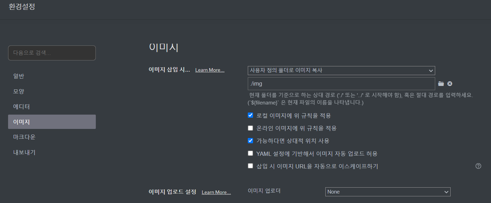

# 0. Just the docs, 너로 정했다
-----
## > 내 블로그, 내가 만들기

1. 아무렇게나 흘러가는 내 의식들을 붙잡아 적어둘 공간이다.  
2. 보안 공부를 하며 얻은 지식들을 정리해두고 필요할 때마다 꺼내 볼 거다.  
3. 사실 막연하고 두렵긴 하지만 일단 아무거나 적고 볼 생각이다.  
4. 목표는 "원하는 내용을 블로그에 담아낼 수 있을 때까지" 이다.  
5. 이 모든 걸 담아두기 위한 테마를 적용할 것이다.  

  

**이 블로그는 `jekyll`방식과 `Just the Docs` 테마를 이용했다!**
 
 
 

-----

## > 이런 블로그를 어떻게 시작하지?
**생각을 현실로 만들려면 시작은 "구글링"이다**  
준비물: 컴퓨터, github 계정, git 프로그램(PC), ruby 설치  
 
상세한 방법은 내가 그림을 첨부할 실력이 됐을 때 작성해야겠다.
 
`Just the docs` 에서 제공하는 설명을 한글로 번역하여 정리했다.  
부족하고 또 부족하지만 정리해둔 사실에 의의를 둔다.  
   

-----

## > 처음 뵙겠습니다 Typora 님

`markdown` 문법을 아예 처음 접하는 나에게 너무나 유용한 프로그램이다.  
생소한 문법으로 작성된 문장들을 스타일이 적용된 상태로 바로 확인할 수 있다.  
물론 tistory와 같은 블로그에서 글을 쓰던 때처럼 쉽고 편하지는 않다.  
그래도 이 프로그램 덕에 조금 할만한 것 같다.

 

* 이미지를 넣을 때 아래 설정을 해두면 편리하다

  

 처음 이미지를 넣으며 두려웠던 부분이 있었는데 이미지를 넣으면 사진의 경로가 PC로 설정되어 내 PC가 아닌 다른 PC에서는 이미지를 못 본다는 생각이였다. (C:\\~~ 로 설정된다면 다른 사용자의 C드라이브엔 해당 이미지가 없을 테니...)

 하지만 해당 설정을 해두면 내가 이미지를 삽입하고 나서 **자동으로 해당 글이 존재하는 폴더에 이미지를 저장하며, 상대경로로 설정하기**에 github에 올려둔 상대경로를 통해 이미지를 로드한다 . `$ git push`를 통해 이미지 파일을 올려주기만 하면 된다.

 때문에 내 PC가 날라가 버리더라도 github에만 이미지가 저장되어 있다면 언제든지 확인할 수 있다. 다만 내 PC에서 이미지를 지운 채 `$ git push` 해버리고 나면 github에서도 이미지가 날라가기 때문에 이미지가 안보일 수 있으니 기억해두자.